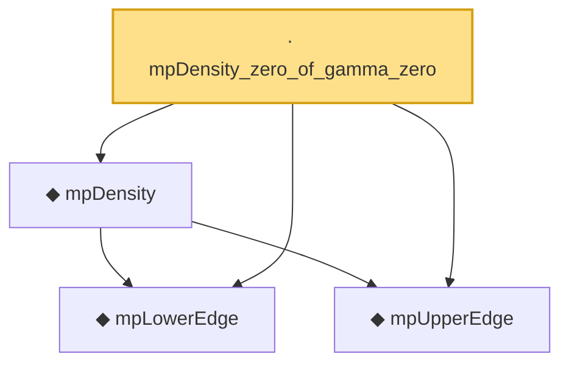

# Proof narrative — mpDensity_zero_of_gamma_zero

Root: **mpDensity_zero_of_gamma_zero** (lemma) `Statlib/RandomMatrix/mpDensity_zero_of_gamma_zero.lean:21` · topic `RandomMatrix`
Closure: 4 declarations across 4 files. Generated from `proof_graph.json` — no files were moved.

Reading order (foundations first, headline last):

  ◆ `mpLowerEdge` — noncomputable def · `Statlib/RandomMatrix/mpLowerEdge.lean:17`  _(also used by 10: marchenko_pastur_convergence, mpDensity_eq_zero_of_lt_lower, mpDensity_eq_zero_of_not_mem, …)_
  ◆ `mpUpperEdge` — noncomputable def · `Statlib/RandomMatrix/mpUpperEdge.lean:17`  _(also used by 11: marchenko_pastur_convergence, mpDensity_eq_zero_of_gt_upper, mpDensity_eq_zero_of_not_mem, …)_
  ◆ `mpDensity` — noncomputable def · `Statlib/RandomMatrix/mpDensity.lean:20`  _(also used by 6: mpDensity_eq_zero_of_gt_upper, mpDensity_eq_zero_of_lt_lower, mpDensity_eq_zero_of_nonpos, …)_
· `mpDensity_zero_of_gamma_zero` — lemma · `Statlib/RandomMatrix/mpDensity_zero_of_gamma_zero.lean:21` **← headline**

## Dependency diagram

