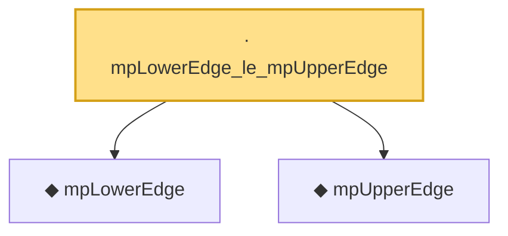

# Proof narrative — mpLowerEdge_le_mpUpperEdge

Root: **mpLowerEdge_le_mpUpperEdge** (lemma) `Statlib/RandomMatrix/mpLowerEdge_le_mpUpperEdge.lean:20` · topic `RandomMatrix`
Closure: 3 declarations across 3 files. Generated from `proof_graph.json` — no files were moved.

Reading order (foundations first, headline last):

  ◆ `mpLowerEdge` — noncomputable def · `Statlib/RandomMatrix/mpLowerEdge.lean:17`  _(also used by 11: marchenko_pastur_convergence, mpDensity, mpDensity_eq_zero_of_lt_lower, …)_
  ◆ `mpUpperEdge` — noncomputable def · `Statlib/RandomMatrix/mpUpperEdge.lean:17`  _(also used by 12: marchenko_pastur_convergence, mpDensity, mpDensity_eq_zero_of_gt_upper, …)_
· `mpLowerEdge_le_mpUpperEdge` — lemma · `Statlib/RandomMatrix/mpLowerEdge_le_mpUpperEdge.lean:20` **← headline**

## Dependency diagram

