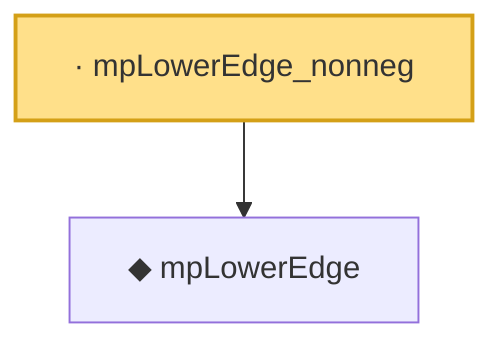

# Proof narrative — mpLowerEdge_nonneg

Root: **mpLowerEdge_nonneg** (lemma) `Statlib/RandomMatrix/mpLowerEdge_nonneg.lean:18` · topic `RandomMatrix`
Closure: 2 declarations across 2 files. Generated from `proof_graph.json` — no files were moved.

Reading order (foundations first, headline last):

  ◆ `mpLowerEdge` — noncomputable def · `Statlib/RandomMatrix/mpLowerEdge.lean:17`  _(also used by 11: marchenko_pastur_convergence, mpDensity, mpDensity_eq_zero_of_lt_lower, …)_
· `mpLowerEdge_nonneg` — lemma · `Statlib/RandomMatrix/mpLowerEdge_nonneg.lean:18` **← headline**

## Dependency diagram

