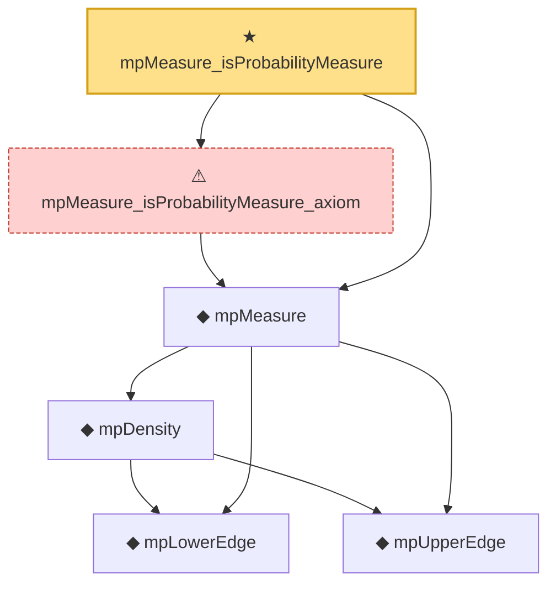

# Proof narrative — mpMeasure_isProbabilityMeasure

Root: **mpMeasure_isProbabilityMeasure** (theorem) `Statlib/RandomMatrix/mpMeasure_isProbabilityMeasure.lean:19` · topic `RandomMatrix`
Closure: 6 declarations across 6 files. Generated from `proof_graph.json` — no files were moved.

Reading order (foundations first, headline last):

    ◆ `mpLowerEdge` — noncomputable def · `Statlib/RandomMatrix/mpLowerEdge.lean:17`  _(also used by 10: marchenko_pastur_convergence, mpDensity_eq_zero_of_lt_lower, mpDensity_eq_zero_of_not_mem, …)_
    ◆ `mpUpperEdge` — noncomputable def · `Statlib/RandomMatrix/mpUpperEdge.lean:17`  _(also used by 11: marchenko_pastur_convergence, mpDensity_eq_zero_of_gt_upper, mpDensity_eq_zero_of_not_mem, …)_
    ◆ `mpDensity` — noncomputable def · `Statlib/RandomMatrix/mpDensity.lean:20`  _(also used by 6: mpDensity_eq_zero_of_gt_upper, mpDensity_eq_zero_of_lt_lower, mpDensity_eq_zero_of_nonpos, …)_
  ◆ `mpMeasure` — noncomputable def · `Statlib/RandomMatrix/mpMeasure.lean:22`  _(also used by 4: marchenko_pastur_convergence, mpStieltjes_fixed_point, mpStieltjes_fixed_point_axiom, …)_
  ⚠ `mpMeasure_isProbabilityMeasure_axiom` — axiom · `Statlib/RandomMatrix/mpMeasure_isProbabilityMeasure_axiom.lean:22`
★ `mpMeasure_isProbabilityMeasure` — theorem · `Statlib/RandomMatrix/mpMeasure_isProbabilityMeasure.lean:19` **← headline**

## Dependency diagram

