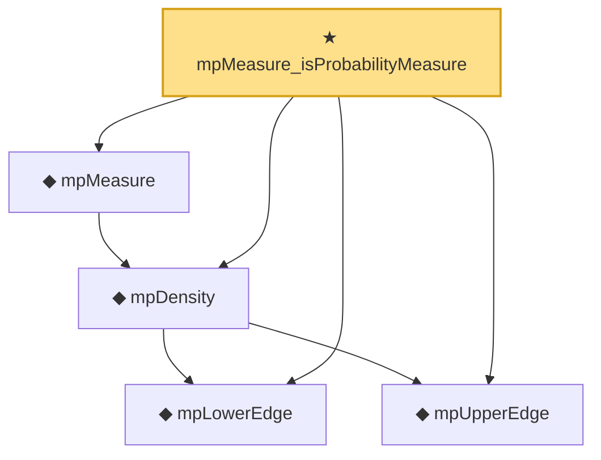

# Proof narrative — mpMeasure_isProbabilityMeasure

Root: **mpMeasure_isProbabilityMeasure** (theorem) `Statlib/RandomMatrix/MeasuresAreProbability.lean:138` · topic `RandomMatrix`
Closure: 5 declarations across 2 files. Generated from `proof_graph.json` — no files were moved.

Reading order (foundations first, headline last):

  ◆ `mpLowerEdge` — noncomputable def · `Statlib/RandomMatrix/Vocabulary/Distributions.lean:56`  _(also used by 1: mpSqrtBranchAsymptotic)_
  ◆ `mpUpperEdge` — noncomputable def · `Statlib/RandomMatrix/Vocabulary/Distributions.lean:62`  _(also used by 1: mpSqrtBranchAsymptotic)_
  ◆ `mpDensity` — noncomputable def · `Statlib/RandomMatrix/Vocabulary/Distributions.lean:71`
  ◆ `mpMeasure` — noncomputable def · `Statlib/RandomMatrix/Vocabulary/Distributions.lean:89`
★ `mpMeasure_isProbabilityMeasure` — theorem · `Statlib/RandomMatrix/MeasuresAreProbability.lean:138` **← headline**

## Dependency diagram

```mermaid
flowchart TD
  n0["◆ mpLowerEdge"]
  n1["◆ mpUpperEdge"]
  n2["◆ mpDensity"]
  n3["◆ mpMeasure"]
  n4["★ mpMeasure_isProbabilityMeasure"]
  n2 --> n0
  n2 --> n1
  n3 --> n2
  n4 --> n3
  n4 --> n0
  n4 --> n1
  n4 --> n2
  class n4 headline;
  classDef headline fill:#ffe08a,stroke:#d4a017,stroke-width:2px;
  classDef axiomNode fill:#ffd0d0,stroke:#c0392b,stroke-dasharray:4 2;
```
