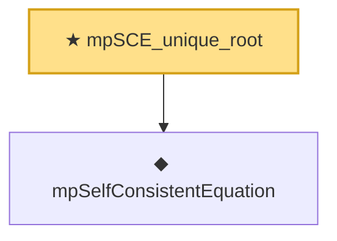

# Proof narrative — mpSCE_unique_root

Root: **mpSCE_unique_root** (theorem) `Statlib/RandomMatrix/MPSceLemmas.lean:519` · topic `RandomMatrix`
Closure: 2 declarations across 2 files. Generated from `proof_graph.json` — no files were moved.

Reading order (foundations first, headline last):

  ◆ `mpSelfConsistentEquation` — noncomputable def · `Statlib/RandomMatrix/Vocabulary/StieltjesTransform.lean:103`
★ `mpSCE_unique_root` — theorem · `Statlib/RandomMatrix/MPSceLemmas.lean:519` **← headline**

## Dependency diagram

