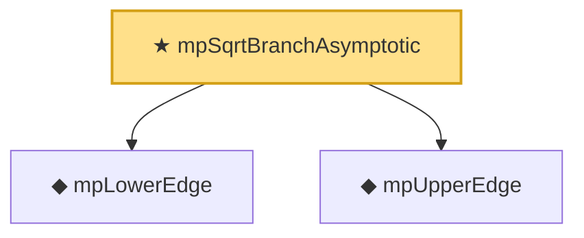

# Proof narrative — mpSqrtBranchAsymptotic

Root: **mpSqrtBranchAsymptotic** (theorem) `Statlib/RandomMatrix/MPSceLemmas.lean:41` · topic `RandomMatrix`
Closure: 3 declarations across 2 files. Generated from `proof_graph.json` — no files were moved.

Reading order (foundations first, headline last):

  ◆ `mpLowerEdge` — noncomputable def · `Statlib/RandomMatrix/Vocabulary/Distributions.lean:56`  _(also used by 2: mpMeasure_isProbabilityMeasure, mpDensity)_
  ◆ `mpUpperEdge` — noncomputable def · `Statlib/RandomMatrix/Vocabulary/Distributions.lean:62`  _(also used by 2: mpMeasure_isProbabilityMeasure, mpDensity)_
★ `mpSqrtBranchAsymptotic` — theorem · `Statlib/RandomMatrix/MPSceLemmas.lean:41` **← headline**

## Dependency diagram

