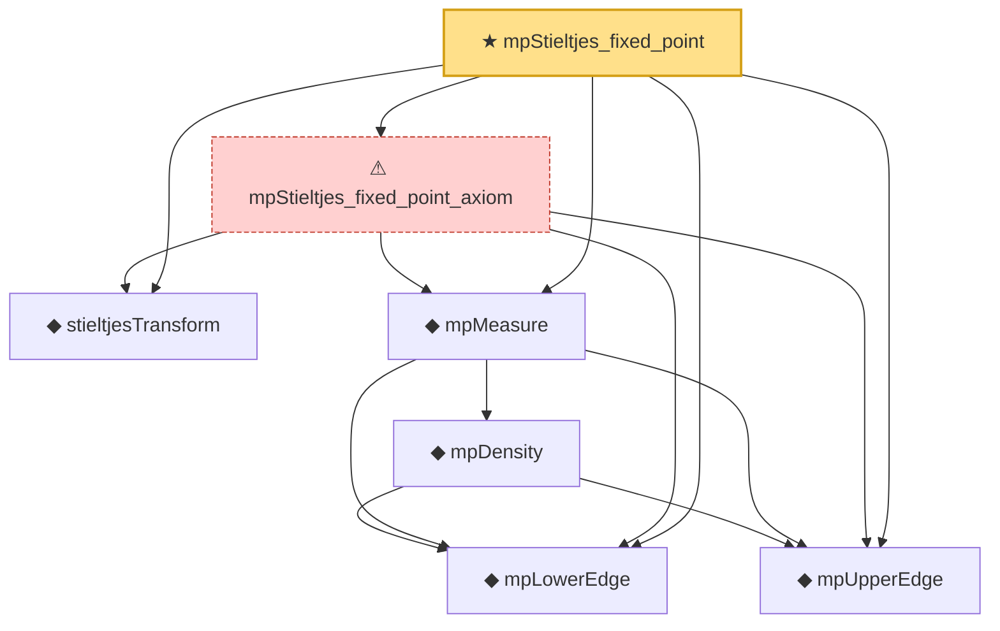

# Proof narrative — mpStieltjes_fixed_point

Root: **mpStieltjes_fixed_point** (theorem) `Statlib/RandomMatrix/mpStieltjes_fixed_point.lean:23` · topic `RandomMatrix`
Closure: 7 declarations across 7 files. Generated from `proof_graph.json` — no files were moved.

Reading order (foundations first, headline last):

  ◆ `mpLowerEdge` — noncomputable def · `Statlib/RandomMatrix/mpLowerEdge.lean:17`  _(also used by 8: marchenko_pastur_convergence, mpDensity_eq_zero_of_lt_lower, mpDensity_eq_zero_of_not_mem, …)_
  ◆ `mpUpperEdge` — noncomputable def · `Statlib/RandomMatrix/mpUpperEdge.lean:17`  _(also used by 9: marchenko_pastur_convergence, mpDensity_eq_zero_of_gt_upper, mpDensity_eq_zero_of_not_mem, …)_
  ◆ `stieltjesTransform` — noncomputable def · `Statlib/RandomMatrix/stieltjesTransform.lean:18`  _(also used by 5: marchenko_pastur_convergence, stieltjesTransform_dirac, stieltjesTransform_smul, …)_
    ◆ `mpDensity` — noncomputable def · `Statlib/RandomMatrix/mpDensity.lean:20`  _(also used by 6: mpDensity_eq_zero_of_gt_upper, mpDensity_eq_zero_of_lt_lower, mpDensity_eq_zero_of_nonpos, …)_
  ◆ `mpMeasure` — noncomputable def · `Statlib/RandomMatrix/mpMeasure.lean:22`  _(also used by 4: marchenko_pastur_convergence, mpMeasure_isProbabilityMeasure, mpMeasure_isProbabilityMeasure_axiom, …)_
  ⚠ `mpStieltjes_fixed_point_axiom` — axiom · `Statlib/RandomMatrix/mpStieltjes_fixed_point_axiom.lean:26`
★ `mpStieltjes_fixed_point` — theorem · `Statlib/RandomMatrix/mpStieltjes_fixed_point.lean:23` **← headline**

## Dependency diagram

