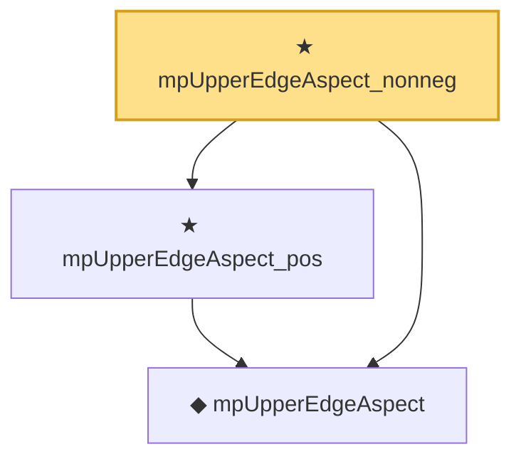

# Proof narrative — mpUpperEdgeAspect_nonneg

Root: **mpUpperEdgeAspect_nonneg** (theorem) `Statlib/RandomMatrix/mpUpperEdgeAspect_nonneg.lean:13` · topic `RandomMatrix`
Closure: 3 declarations across 3 files. Generated from `proof_graph.json` — no files were moved.

Reading order (foundations first, headline last):

  ◆ `mpUpperEdgeAspect` — noncomputable def · `Statlib/RandomMatrix/mpUpperEdgeAspect.lean:13`  _(also used by 2: bbp_above_strictly_above_edge_of_spike_separated, bbp_transition_above)_
  ★ `mpUpperEdgeAspect_pos` — theorem · `Statlib/RandomMatrix/mpUpperEdgeAspect_pos.lean:12`
★ `mpUpperEdgeAspect_nonneg` — theorem · `Statlib/RandomMatrix/mpUpperEdgeAspect_nonneg.lean:13` **← headline**

## Dependency diagram

