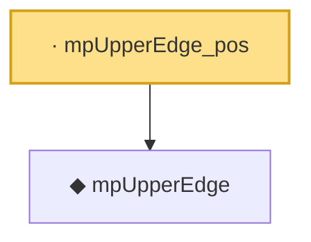

# Proof narrative — mpUpperEdge_pos

Root: **mpUpperEdge_pos** (lemma) `Statlib/RandomMatrix/mpUpperEdge_pos.lean:18` · topic `RandomMatrix`
Closure: 2 declarations across 2 files. Generated from `proof_graph.json` — no files were moved.

Reading order (foundations first, headline last):

  ◆ `mpUpperEdge` — noncomputable def · `Statlib/RandomMatrix/mpUpperEdge.lean:17`  _(also used by 12: marchenko_pastur_convergence, mpDensity, mpDensity_eq_zero_of_gt_upper, …)_
· `mpUpperEdge_pos` — lemma · `Statlib/RandomMatrix/mpUpperEdge_pos.lean:18` **← headline**

## Dependency diagram

