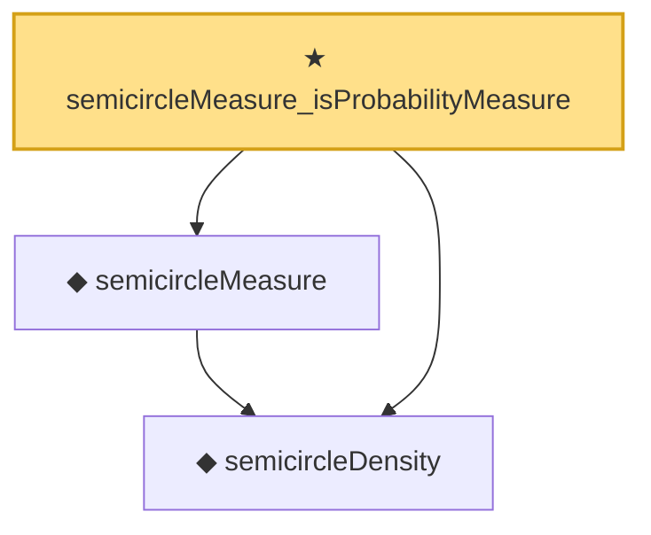

# Proof narrative — semicircleMeasure_isProbabilityMeasure

Root: **semicircleMeasure_isProbabilityMeasure** (theorem) `Statlib/RandomMatrix/MeasuresAreProbability.lean:20` · topic `RandomMatrix`
Closure: 3 declarations across 2 files. Generated from `proof_graph.json` — no files were moved.

Reading order (foundations first, headline last):

  ◆ `semicircleDensity` — noncomputable def · `Statlib/RandomMatrix/Vocabulary/Distributions.lean:35`
  ◆ `semicircleMeasure` — noncomputable def · `Statlib/RandomMatrix/Vocabulary/Distributions.lean:44`
★ `semicircleMeasure_isProbabilityMeasure` — theorem · `Statlib/RandomMatrix/MeasuresAreProbability.lean:20` **← headline**

## Dependency diagram

