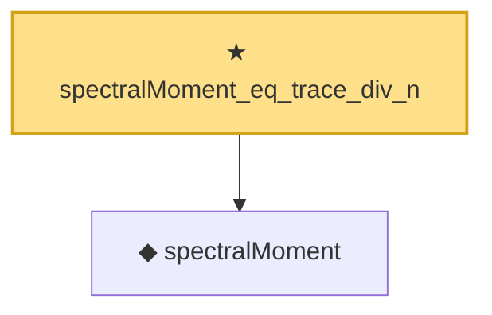

# Proof narrative — spectralMoment_eq_trace_div_n

Root: **spectralMoment_eq_trace_div_n** (theorem) `Statlib/RandomMatrix/SpectralMoment.lean:22` · topic `RandomMatrix`
Closure: 2 declarations across 2 files. Generated from `proof_graph.json` — no files were moved.

Reading order (foundations first, headline last):

  ◆ `spectralMoment` — noncomputable def · `Statlib/RandomMatrix/Vocabulary/StieltjesTransform.lean:69`  _(also used by 1: empiricalSpectralMeasure_moment_eq)_
★ `spectralMoment_eq_trace_div_n` — theorem · `Statlib/RandomMatrix/SpectralMoment.lean:22` **← headline**

## Dependency diagram

