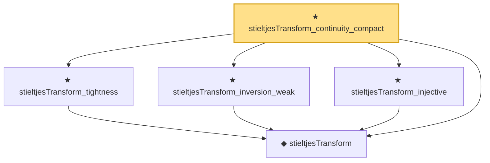

# Proof narrative — stieltjesTransform_continuity_compact

Root: **stieltjesTransform_continuity_compact** (theorem) `Statlib/RandomMatrix/StieltjesAnalysis.lean:3240` · topic `RandomMatrix`
Closure: 5 declarations across 2 files. Generated from `proof_graph.json` — no files were moved.

Reading order (foundations first, headline last):

  ◆ `stieltjesTransform` — noncomputable def · `Statlib/RandomMatrix/Vocabulary/StieltjesTransform.lean:48`  _(also used by 4: stieltjesTransform_asymptotic, stieltjesTransform_moment_expansion, stieltjesTransform_bound, …)_
  ★ `stieltjesTransform_tightness` — theorem · `Statlib/RandomMatrix/StieltjesAnalysis.lean:1555`
  ★ `stieltjesTransform_inversion_weak` — theorem · `Statlib/RandomMatrix/StieltjesAnalysis.lean:939`
  ★ `stieltjesTransform_injective` — theorem · `Statlib/RandomMatrix/StieltjesAnalysis.lean:2223`
★ `stieltjesTransform_continuity_compact` — theorem · `Statlib/RandomMatrix/StieltjesAnalysis.lean:3240` **← headline**

## Dependency diagram

