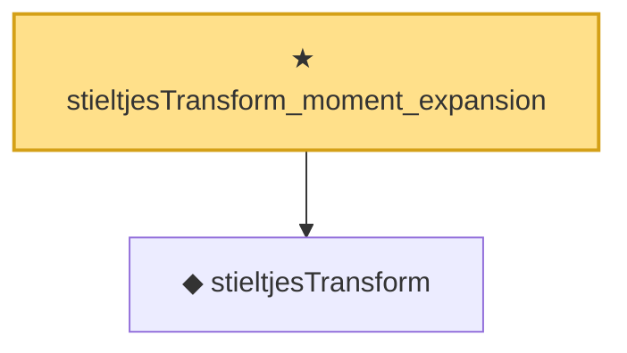

# Proof narrative — stieltjesTransform_moment_expansion

Root: **stieltjesTransform_moment_expansion** (theorem) `Statlib/RandomMatrix/StieltjesAnalysis.lean:701` · topic `RandomMatrix`
Closure: 2 declarations across 2 files. Generated from `proof_graph.json` — no files were moved.

Reading order (foundations first, headline last):

  ◆ `stieltjesTransform` — noncomputable def · `Statlib/RandomMatrix/Vocabulary/StieltjesTransform.lean:48`  _(also used by 7: stieltjesTransform_asymptotic, stieltjesTransform_inversion_weak, stieltjesTransform_tightness, …)_
★ `stieltjesTransform_moment_expansion` — theorem · `Statlib/RandomMatrix/StieltjesAnalysis.lean:701` **← headline**

## Dependency diagram

