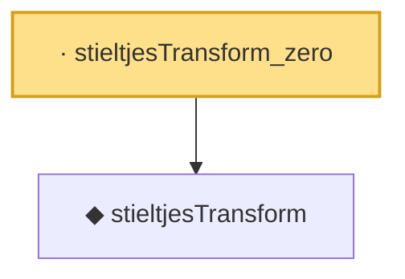

# Proof narrative — stieltjesTransform_zero

Root: **stieltjesTransform_zero** (lemma) `Statlib/RandomMatrix/stieltjesTransform_zero.lean:18` · topic `RandomMatrix`
Closure: 2 declarations across 2 files. Generated from `proof_graph.json` — no files were moved.

Reading order (foundations first, headline last):

  ◆ `stieltjesTransform` — noncomputable def · `Statlib/RandomMatrix/stieltjesTransform.lean:18`  _(also used by 6: marchenko_pastur_convergence, mpStieltjes_fixed_point, mpStieltjes_fixed_point_axiom, …)_
· `stieltjesTransform_zero` — lemma · `Statlib/RandomMatrix/stieltjesTransform_zero.lean:18` **← headline**

## Dependency diagram

