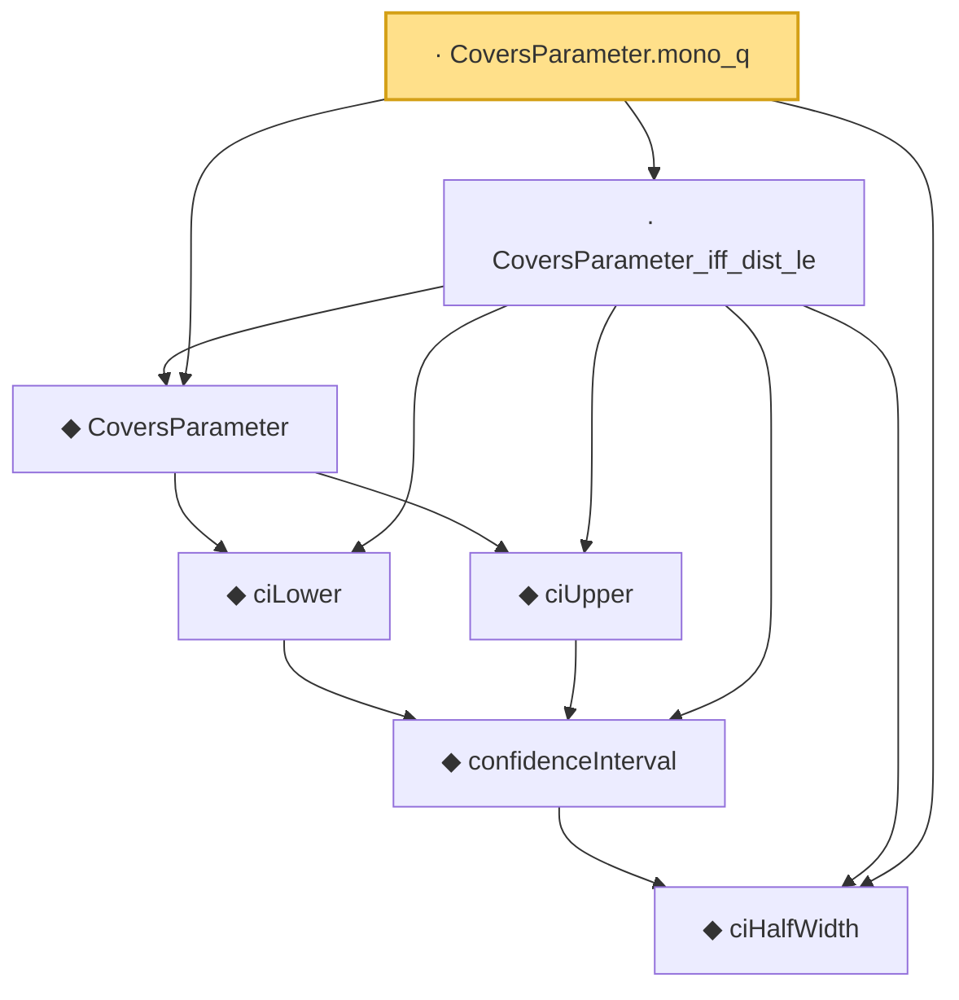

# Proof narrative — CoversParameter.mono_q

Root: **CoversParameter.mono_q** (lemma) `Statlib/Regression/CoversParameter_mono_q.lean:11` · topic `Regression`
Closure: 7 declarations across 7 files. Generated from `proof_graph.json` — no files were moved.

Reading order (foundations first, headline last):

  ◆ `ciHalfWidth` — noncomputable def · `Statlib/Regression/ciHalfWidth.lean:7`  _(also used by 2: ciHalfWidth_nonneg, ciHalfWidth_zero)_
    ◆ `confidenceInterval` — noncomputable def · `Statlib/Regression/confidenceInterval.lean:10`
    ◆ `ciLower` — noncomputable def · `Statlib/Regression/ciLower.lean:8`
    ◆ `ciUpper` — noncomputable def · `Statlib/Regression/ciUpper.lean:8`
  ◆ `CoversParameter` — def · `Statlib/Regression/CoversParameter.lean:9`
  · `CoversParameter_iff_dist_le` — lemma · `Statlib/Regression/CoversParameter_iff_dist_le.lean:12`
· `CoversParameter.mono_q` — lemma · `Statlib/Regression/CoversParameter_mono_q.lean:11` **← headline**

## Dependency diagram

