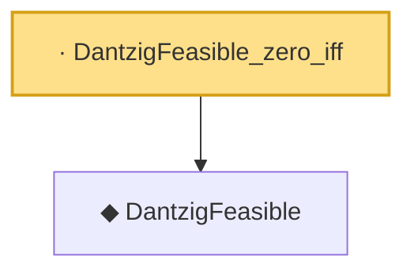

# Proof narrative — DantzigFeasible_zero_iff

Root: **DantzigFeasible_zero_iff** (lemma) `Statlib/Regression/DantzigFeasible_zero_iff.lean:8` · topic `Regression`
Closure: 2 declarations across 2 files. Generated from `proof_graph.json` — no files were moved.

Reading order (foundations first, headline last):

  ◆ `DantzigFeasible` — def · `Statlib/Regression/DantzigFeasible.lean:9`  _(also used by 2: DantzigFeasible.of_good_event, IsDantzigSelector)_
· `DantzigFeasible_zero_iff` — lemma · `Statlib/Regression/DantzigFeasible_zero_iff.lean:8` **← headline**

## Dependency diagram

