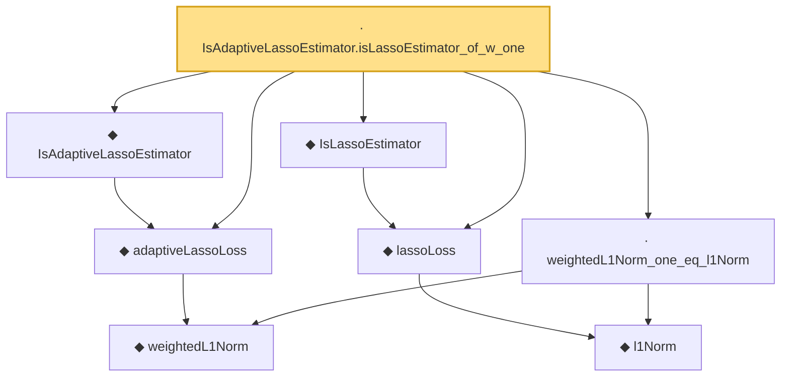

# Proof narrative — IsAdaptiveLassoEstimator.isLassoEstimator_of_w_one

Root: **IsAdaptiveLassoEstimator.isLassoEstimator_of_w_one** (lemma) `Statlib/Regression/IsAdaptiveLassoEstimator_isLassoEstimator_of_w_one.lean:12` · topic `Regression`
Closure: 8 declarations across 8 files. Generated from `proof_graph.json` — no files were moved.

Reading order (foundations first, headline last):

    ◆ `weightedL1Norm` — def · `Statlib/Regression/weightedL1Norm.lean:11`  _(also used by 2: adaptive_lasso_basic_inequality, weightedL1Norm_nonneg)_
  ◆ `adaptiveLassoLoss` — noncomputable def · `Statlib/Regression/adaptiveLassoLoss.lean:12`  _(also used by 1: adaptive_lasso_basic_inequality)_
  ◆ `IsAdaptiveLassoEstimator` — def · `Statlib/Regression/IsAdaptiveLassoEstimator.lean:10`  _(also used by 1: adaptive_lasso_basic_inequality)_
    ◆ `l1Norm` — def · `Statlib/Regression/l1Norm.lean:15`  _(also used by 24: IsDantzigSelector, IsDantzigSelector.l1_le_truth, IsSqrtLassoEstimator.l1_diff_bound, …)_
  ◆ `lassoLoss` — noncomputable def · `Statlib/Regression/lassoLoss.lean:16`  _(also used by 3: elasticNetLoss_eq_lasso_of_lam2_zero, fusedLassoLoss_eq_lasso_of_lam2_zero, lasso_basic_inequality)_
  ◆ `IsLassoEstimator` — def · `Statlib/Regression/IsLassoEstimator.lean:15`  _(also used by 6: lasso_basic_inequality, lasso_cone_constraint, lasso_l1_error, …)_
  · `weightedL1Norm_one_eq_l1Norm` — lemma · `Statlib/Regression/weightedL1Norm_one_eq_l1Norm.lean:9`
· `IsAdaptiveLassoEstimator.isLassoEstimator_of_w_one` — lemma · `Statlib/Regression/IsAdaptiveLassoEstimator_isLassoEstimator_of_w_one.lean:12` **← headline**

## Dependency diagram

