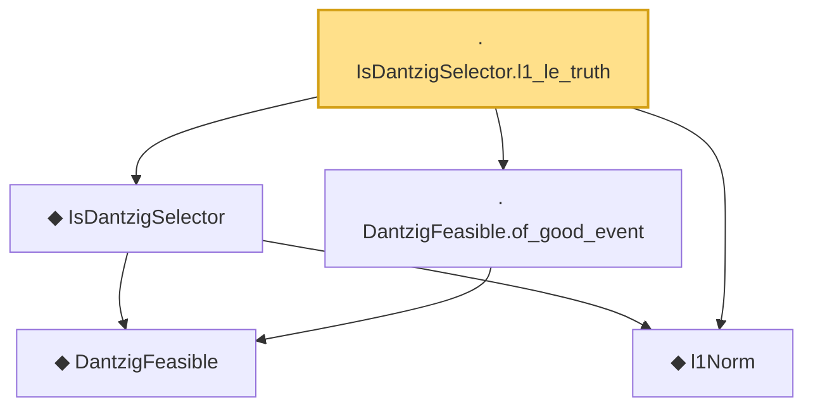

# Proof narrative — IsDantzigSelector.l1_le_truth

Root: **IsDantzigSelector.l1_le_truth** (lemma) `Statlib/Regression/IsDantzigSelector_l1_le_truth.lean:11` · topic `Regression`
Closure: 5 declarations across 5 files. Generated from `proof_graph.json` — no files were moved.

Reading order (foundations first, headline last):

    ◆ `DantzigFeasible` — def · `Statlib/Regression/DantzigFeasible.lean:9`  _(also used by 1: DantzigFeasible_zero_iff)_
  ◆ `l1Norm` — def · `Statlib/Regression/l1Norm.lean:15`  _(also used by 24: IsSqrtLassoEstimator.l1_diff_bound, dPenalty_identity_eq_l1Norm, elasticNetLoss, …)_
  ◆ `IsDantzigSelector` — def · `Statlib/Regression/IsDantzigSelector.lean:9`  _(also used by 1: dantzig_error_dual_bound)_
  · `DantzigFeasible.of_good_event` — lemma · `Statlib/Regression/DantzigFeasible_of_good_event.lean:9`
· `IsDantzigSelector.l1_le_truth` — lemma · `Statlib/Regression/IsDantzigSelector_l1_le_truth.lean:11` **← headline**

## Dependency diagram

