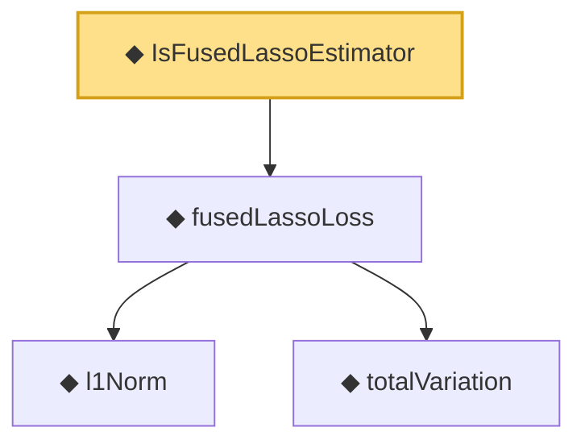

# Proof narrative — IsFusedLassoEstimator

Root: **IsFusedLassoEstimator** (def) `Statlib/Regression/IsFusedLassoEstimator.lean:10` · topic `Regression`
Closure: 4 declarations across 4 files. Generated from `proof_graph.json` — no files were moved.

Reading order (foundations first, headline last):

    ◆ `l1Norm` — def · `Statlib/Regression/l1Norm.lean:15`  _(also used by 25: IsDantzigSelector, IsDantzigSelector.l1_le_truth, IsSqrtLassoEstimator.l1_diff_bound, …)_
    ◆ `totalVariation` — def · `Statlib/Regression/totalVariation.lean:13`  _(also used by 4: fusedLassoLoss_nonneg, totalVariation_const, totalVariation_nonneg, …)_
  ◆ `fusedLassoLoss` — noncomputable def · `Statlib/Regression/fusedLassoLoss.lean:12`  _(also used by 2: fusedLassoLoss_eq_lasso_of_lam2_zero, fusedLassoLoss_nonneg)_
◆ `IsFusedLassoEstimator` — def · `Statlib/Regression/IsFusedLassoEstimator.lean:10` **← headline**

## Dependency diagram

