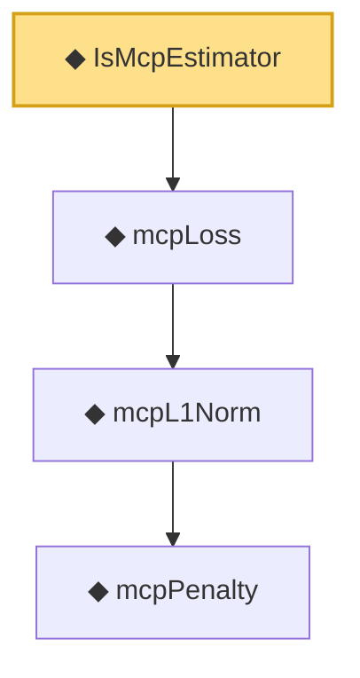

# Proof narrative — IsMcpEstimator

Root: **IsMcpEstimator** (def) `Statlib/Regression/IsMcpEstimator.lean:9` · topic `Regression`
Closure: 4 declarations across 4 files. Generated from `proof_graph.json` — no files were moved.

Reading order (foundations first, headline last):

      ◆ `mcpPenalty` — noncomputable def · `Statlib/Regression/mcpPenalty.lean:10`  _(also used by 4: mcpPenalty_eq_const_of_abs_gt_gam_lam, mcpPenalty_eq_quadratic_of_abs_le_gam_lam, mcpPenalty_neg, …)_
    ◆ `mcpL1Norm` — noncomputable def · `Statlib/Regression/mcpL1Norm.lean:11`  _(also used by 1: mcpL1Norm_nonneg)_
  ◆ `mcpLoss` — noncomputable def · `Statlib/Regression/mcpLoss.lean:9`
◆ `IsMcpEstimator` — def · `Statlib/Regression/IsMcpEstimator.lean:9` **← headline**

## Dependency diagram

