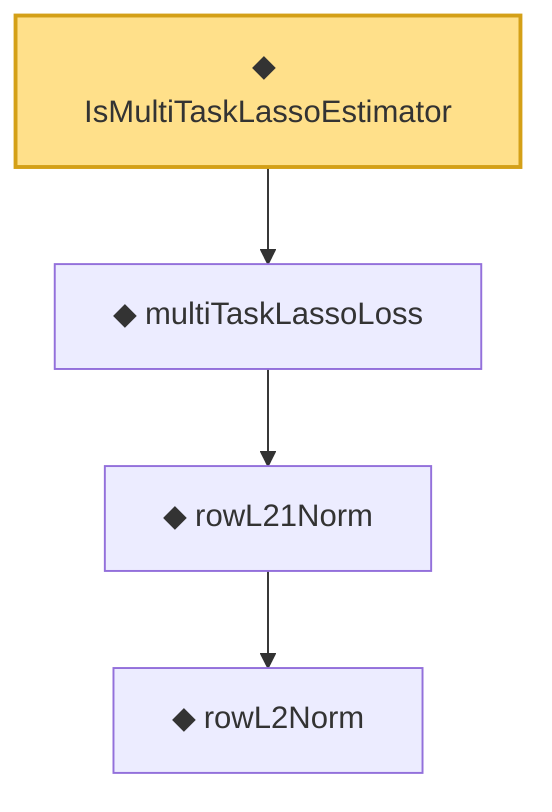

# Proof narrative — IsMultiTaskLassoEstimator

Root: **IsMultiTaskLassoEstimator** (def) `Statlib/Regression/IsMultiTaskLassoEstimator.lean:10` · topic `Regression`
Closure: 4 declarations across 4 files. Generated from `proof_graph.json` — no files were moved.

Reading order (foundations first, headline last):

      ◆ `rowL2Norm` — noncomputable def · `Statlib/Regression/rowL2Norm.lean:8`  _(also used by 1: rowL2Norm_nonneg)_
    ◆ `rowL21Norm` — noncomputable def · `Statlib/Regression/rowL21Norm.lean:9`  _(also used by 2: multiTaskLassoLoss_nonneg, rowL21Norm_nonneg)_
  ◆ `multiTaskLassoLoss` — noncomputable def · `Statlib/Regression/multiTaskLassoLoss.lean:10`  _(also used by 1: multiTaskLassoLoss_nonneg)_
◆ `IsMultiTaskLassoEstimator` — def · `Statlib/Regression/IsMultiTaskLassoEstimator.lean:10` **← headline**

## Dependency diagram

