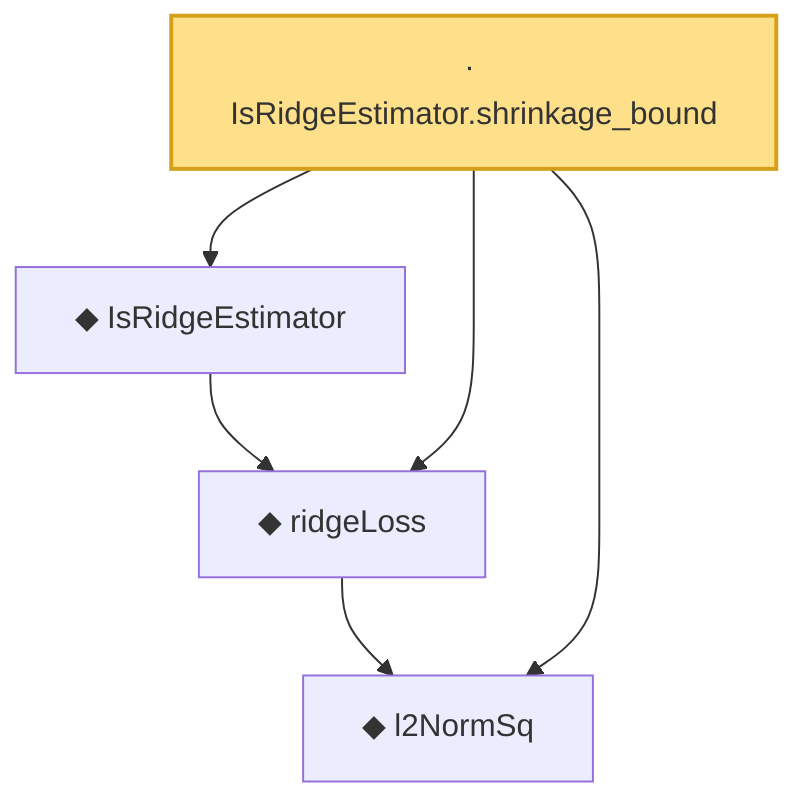

# Proof narrative — IsRidgeEstimator.shrinkage_bound

Root: **IsRidgeEstimator.shrinkage_bound** (lemma) `Statlib/Regression/IsRidgeEstimator_shrinkage_bound.lean:24` · topic `Regression`
Closure: 4 declarations across 4 files. Generated from `proof_graph.json` — no files were moved.

Reading order (foundations first, headline last):

  ◆ `l2NormSq` — def · `Statlib/Regression/l2NormSq.lean:14`  _(also used by 7: elasticNetLoss, elasticNetLoss_nonneg, elastic_net_basic_inequality, …)_
  ◆ `ridgeLoss` — noncomputable def · `Statlib/Regression/ridgeLoss.lean:15`  _(also used by 2: elasticNetLoss_eq_ridge_of_lam1_zero, ridgeLoss_nonneg)_
  ◆ `IsRidgeEstimator` — def · `Statlib/Regression/IsRidgeEstimator.lean:14`
· `IsRidgeEstimator.shrinkage_bound` — lemma · `Statlib/Regression/IsRidgeEstimator_shrinkage_bound.lean:24` **← headline**

## Dependency diagram

