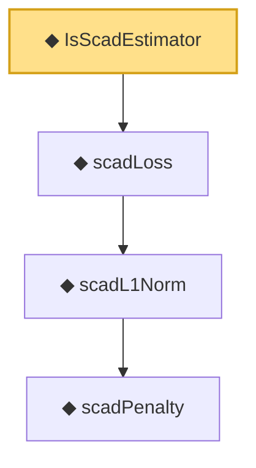

# Proof narrative — IsScadEstimator

Root: **IsScadEstimator** (def) `Statlib/Regression/IsScadEstimator.lean:11` · topic `Regression`
Closure: 4 declarations across 4 files. Generated from `proof_graph.json` — no files were moved.

Reading order (foundations first, headline last):

      ◆ `scadPenalty` — noncomputable def · `Statlib/Regression/scadPenalty.lean:10`  _(also used by 4: scadPenalty_eq_const_of_abs_gt_a_lam, scadPenalty_eq_lasso_of_abs_le_lam, scadPenalty_neg, …)_
    ◆ `scadL1Norm` — noncomputable def · `Statlib/Regression/scadL1Norm.lean:11`  _(also used by 1: scadL1Norm_nonneg)_
  ◆ `scadLoss` — noncomputable def · `Statlib/Regression/scadLoss.lean:12`
◆ `IsScadEstimator` — def · `Statlib/Regression/IsScadEstimator.lean:11` **← headline**

## Dependency diagram

