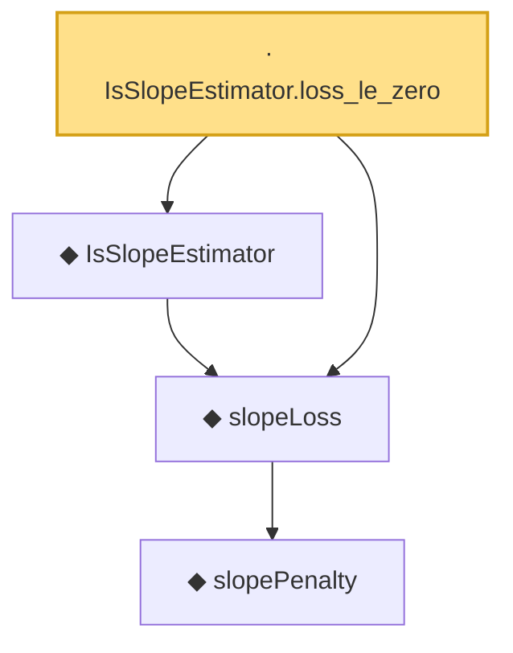

# Proof narrative — IsSlopeEstimator.loss_le_zero

Root: **IsSlopeEstimator.loss_le_zero** (lemma) `Statlib/Regression/IsSlopeEstimator_loss_le_zero.lean:17` · topic `Regression`
Closure: 4 declarations across 4 files. Generated from `proof_graph.json` — no files were moved.

Reading order (foundations first, headline last):

      ◆ `slopePenalty` — noncomputable def · `Statlib/Regression/slopePenalty.lean:18`  _(also used by 2: slopeLoss_nonneg, slopePenalty_nonneg)_
  ◆ `slopeLoss` — noncomputable def · `Statlib/Regression/slopeLoss.lean:15`  _(also used by 1: slopeLoss_nonneg)_
  ◆ `IsSlopeEstimator` — def · `Statlib/Regression/IsSlopeEstimator.lean:15`
· `IsSlopeEstimator.loss_le_zero` — lemma · `Statlib/Regression/IsSlopeEstimator_loss_le_zero.lean:17` **← headline**

## Dependency diagram

