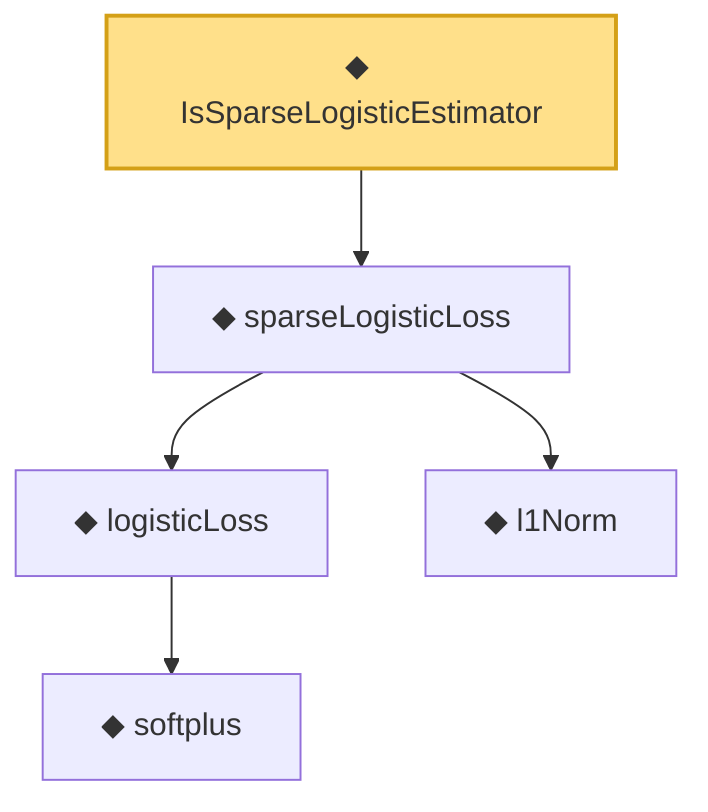

# Proof narrative — IsSparseLogisticEstimator

Root: **IsSparseLogisticEstimator** (def) `Statlib/Regression/IsSparseLogisticEstimator.lean:13` · topic `Regression`
Closure: 5 declarations across 5 files. Generated from `proof_graph.json` — no files were moved.

Reading order (foundations first, headline last):

      ◆ `softplus` — noncomputable def · `Statlib/Regression/softplus.lean:14`  _(also used by 5: logistic_pointwise_nonneg, softplus_ge_id, softplus_nonneg, …)_
    ◆ `logisticLoss` — noncomputable def · `Statlib/Regression/logisticLoss.lean:15`  _(also used by 1: sparseLogisticLoss_nonneg)_
    ◆ `l1Norm` — def · `Statlib/Regression/l1Norm.lean:15`  _(also used by 25: IsDantzigSelector, IsDantzigSelector.l1_le_truth, IsSqrtLassoEstimator.l1_diff_bound, …)_
  ◆ `sparseLogisticLoss` — noncomputable def · `Statlib/Regression/sparseLogisticLoss.lean:14`  _(also used by 1: sparseLogisticLoss_nonneg)_
◆ `IsSparseLogisticEstimator` — def · `Statlib/Regression/IsSparseLogisticEstimator.lean:13` **← headline**

## Dependency diagram

