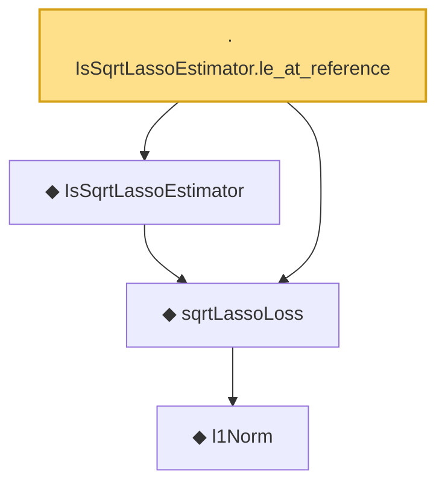

# Proof narrative — IsSqrtLassoEstimator.le_at_reference

Root: **IsSqrtLassoEstimator.le_at_reference** (lemma) `Statlib/Regression/IsSqrtLassoEstimator_le_at_reference.lean:13` · topic `Regression`
Closure: 4 declarations across 4 files. Generated from `proof_graph.json` — no files were moved.

Reading order (foundations first, headline last):

      ◆ `l1Norm` — def · `Statlib/Regression/l1Norm.lean:15`  _(also used by 25: IsDantzigSelector, IsDantzigSelector.l1_le_truth, IsSqrtLassoEstimator.l1_diff_bound, …)_
  ◆ `sqrtLassoLoss` — noncomputable def · `Statlib/Regression/sqrtLassoLoss.lean:10`  _(also used by 3: IsSqrtLassoEstimator.l1_diff_bound, sqrtLassoLoss_nonneg, sqrt_lasso_basic_inequality)_
  ◆ `IsSqrtLassoEstimator` — def · `Statlib/Regression/IsSqrtLassoEstimator.lean:11`  _(also used by 3: IsSqrtLassoEstimator.l1_diff_bound, sqrt_lasso_basic_inequality, sqrt_lasso_oracle_bound)_
· `IsSqrtLassoEstimator.le_at_reference` — lemma · `Statlib/Regression/IsSqrtLassoEstimator_le_at_reference.lean:13` **← headline**

## Dependency diagram

