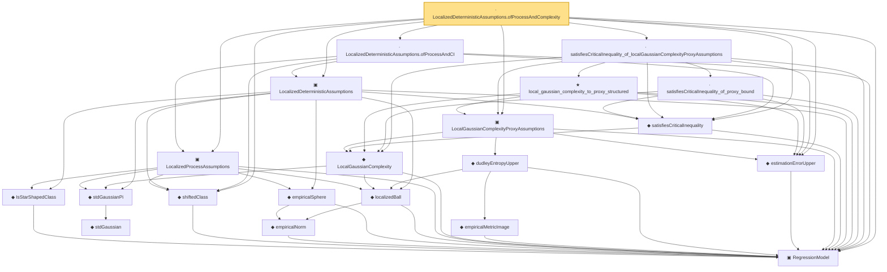

# Proof narrative — LocalizedDeterministicAssumptions.ofProcessAndComplexity

Root: **LocalizedDeterministicAssumptions.ofProcessAndComplexity** (lemma) `Statlib/Regression/LocalizedDeterministicAssumptions_ofProcessAndComplexity.lean:20` · topic `Regression`
Closure: 21 declarations across 20 files. Generated from `proof_graph.json` — no files were moved.

Reading order (foundations first, headline last):

  ▣ `RegressionModel` — structure · `Statlib/Regression/Basic.lean:29`  _(also used by 65: excessRisk, LocalGaussianComplexityEntropyAssumptions, LocalGaussianComplexityProxyAssumptions.ofEntropy, …)_
    ◆ `IsStarShapedClass` — def · `Statlib/Regression/IsStarShapedClass.lean:10`  _(also used by 1: LocalizedProxyCriticalAssumptions)_
  ◆ `shiftedClass` — def · `Statlib/Regression/shiftedClass.lean:10`  _(also used by 5: LocalizedDeterministicAssumptions.ofProcessAndEntropy, LocalizedProxyCriticalAssumptions, LocalizedProxyCriticalAssumptions.ofProcessAndComplexity, …)_
      ◆ `empiricalNorm` — def · `Statlib/Regression/empiricalNorm.lean:10`  _(also used by 25: LocalizedProbabilityAssumptions, LocalizedProbabilityAssumptions.ofDeterministic, LocalizedProbabilityAssumptions.ofProcessAndComplexity, …)_
    ◆ `empiricalSphere` — def · `Statlib/Regression/empiricalSphere.lean:11`  _(also used by 1: LocalizedProxyCriticalAssumptions)_
    ◆ `localizedBall` — def · `Statlib/Regression/localizedBall.lean:11`  _(also used by 3: LocalGaussianComplexityEntropyAssumptions, LocalizedProxyCriticalAssumptions, dudleyEntropyUpper_le_estimationErrorUpper_of_entropyIntegral_le_Msq)_
      ◆ `stdGaussian` — abbrev · `Statlib/Gaussian/Basic.lean:29`  _(also used by 97: TensorizationLSIAt, stdGaussianPi_absolutelyContinuous, integrable_mul_gaussianPDFReal_of_memLp, …)_
    ◆ `stdGaussianPi` — def · `Statlib/Gaussian/Basic.lean:32`  _(also used by 66: TensorizationLSIAt, GaussianSobolevRegularity, isProbabilityMeasure_stdGaussianPi, …)_
  ▣ `LocalizedProcessAssumptions` — structure · `Statlib/Regression/LocalizedProcessAssumptions.lean:14`  _(also used by 4: LocalizedDeterministicAssumptions.ofProcessAndEntropy, LocalizedDeterministicAssumptions.toProcess, LocalizedProxyCriticalAssumptions.ofProcessAndComplexity, …)_
    ◆ `LocalGaussianComplexity` — def · `Statlib/Regression/LocalGaussianComplexity.lean:11`  _(also used by 6: LocalGaussianComplexityEntropyAssumptions, LocalizedProxyCriticalAssumptions, localGaussianComplexity_le_of_satisfiesCriticalInequality, …)_
      ◆ `empiricalMetricImage` — def · `Statlib/Regression/empiricalMetricImage.lean:11`  _(also used by 2: LocalGaussianComplexityEntropyAssumptions, dudleyEntropyUpper_le_estimationErrorUpper_of_entropyIntegral_le_Msq)_
    ◆ `dudleyEntropyUpper` — def · `Statlib/Regression/dudleyEntropyUpper.lean:12`  _(also used by 4: LocalGaussianComplexityEntropyAssumptions, dudleyEntropyUpper_le_estimationErrorUpper_of_entropyIntegral_le_Msq, local_gaussian_complexity_bound, …)_
  ◆ `estimationErrorUpper` — def · `Statlib/Regression/estimationErrorUpper.lean:11`  _(also used by 47: LocalizedDeterministicAssumptions.ofProcessAndEntropy, LocalizedProxyCriticalAssumptions, LocalizedProxyCriticalAssumptions.ofProcessAndComplexity, …)_
  ▣ `LocalGaussianComplexityProxyAssumptions` — structure · `Statlib/Regression/LocalGaussianComplexityProxyAssumptions.lean:13`  _(also used by 4: LocalGaussianComplexityProxyAssumptions.ofEntropy, LocalizedDeterministicAssumptions.ofProcessAndEntropy, LocalizedProxyCriticalAssumptions.ofProcessAndComplexity, …)_
  ◆ `satisfiesCriticalInequality` — def · `Statlib/Regression/satisfiesCriticalInequality.lean:11`  _(also used by 3: LocalizedDeterministicAssumptions.ofProcessAndEntropy, localGaussianComplexity_le_of_satisfiesCriticalInequality, satisfiesCriticalInequality_of_localGaussianComplexity_le)_
  ▣ `LocalizedDeterministicAssumptions` — structure · `Statlib/Regression/LocalizedDeterministicAssumptions.lean:15`  _(also used by 3: LocalizedDeterministicAssumptions.ofProcessAndEntropy, LocalizedDeterministicAssumptions.toProcess, LocalizedProxyCriticalAssumptions.toDeterministic)_
    ★ `local_gaussian_complexity_to_proxy_structured` — theorem · `Statlib/Regression/local_gaussian_complexity_to_proxy_structured.lean:13`  _(also used by 1: LocalizedProxyCriticalAssumptions.ofProcessAndComplexity)_
    · `satisfiesCriticalInequality_of_proxy_bound` — lemma · `Statlib/Regression/satisfiesCriticalInequality_of_proxy_bound.lean:13`  _(also used by 1: LocalizedProxyCriticalAssumptions.toDeterministic)_
  · `satisfiesCriticalInequality_of_localGaussianComplexityProxyAssumptions` — lemma · `Statlib/Regression/satisfiesCriticalInequality_of_localGaussianComplexityProxyAssumptions.lean:17`  _(also used by 1: LocalizedDeterministicAssumptions.ofProcessAndEntropy)_
  · `LocalizedDeterministicAssumptions.ofProcessAndCI` — lemma · `Statlib/Regression/LocalizedDeterministicAssumptions_ofProcessAndCI.lean:15`  _(also used by 1: LocalizedDeterministicAssumptions.ofProcessAndEntropy)_
· `LocalizedDeterministicAssumptions.ofProcessAndComplexity` — lemma · `Statlib/Regression/LocalizedDeterministicAssumptions_ofProcessAndComplexity.lean:20` **← headline**

## Dependency diagram

