# Proof narrative — LocalizedDeterministicAssumptions.ofProcessAndEntropy

Root: **LocalizedDeterministicAssumptions.ofProcessAndEntropy** (lemma) `Statlib/Regression/LocalizedDeterministicAssumptions_ofProcessAndEntropy.lean:21` · topic `Regression`
Closure: 24 declarations across 23 files. Generated from `proof_graph.json` — no files were moved.

Reading order (foundations first, headline last):

  ▣ `RegressionModel` — structure · `Statlib/Regression/Basic.lean:29`  _(also used by 62: excessRisk, LocalizedDeterministicAssumptions.ofProcessAndComplexity, LocalizedDeterministicAssumptions.toProcess, …)_
    ◆ `IsStarShapedClass` — def · `Statlib/Regression/IsStarShapedClass.lean:10`  _(also used by 1: LocalizedProxyCriticalAssumptions)_
  ◆ `shiftedClass` — def · `Statlib/Regression/shiftedClass.lean:10`  _(also used by 5: LocalizedDeterministicAssumptions.ofProcessAndComplexity, LocalizedProxyCriticalAssumptions, LocalizedProxyCriticalAssumptions.ofProcessAndComplexity, …)_
      ◆ `empiricalNorm` — def · `Statlib/Regression/empiricalNorm.lean:10`  _(also used by 25: LocalizedProbabilityAssumptions, LocalizedProbabilityAssumptions.ofDeterministic, LocalizedProbabilityAssumptions.ofProcessAndComplexity, …)_
    ◆ `empiricalSphere` — def · `Statlib/Regression/empiricalSphere.lean:11`  _(also used by 1: LocalizedProxyCriticalAssumptions)_
    ◆ `localizedBall` — def · `Statlib/Regression/localizedBall.lean:11`  _(also used by 1: LocalizedProxyCriticalAssumptions)_
      ◆ `stdGaussian` — abbrev · `Statlib/Gaussian/Basic.lean:29`  _(also used by 97: TensorizationLSIAt, stdGaussianPi_absolutelyContinuous, integrable_mul_gaussianPDFReal_of_memLp, …)_
    ◆ `stdGaussianPi` — def · `Statlib/Gaussian/Basic.lean:32`  _(also used by 66: TensorizationLSIAt, GaussianSobolevRegularity, isProbabilityMeasure_stdGaussianPi, …)_
  ▣ `LocalizedProcessAssumptions` — structure · `Statlib/Regression/LocalizedProcessAssumptions.lean:14`  _(also used by 4: LocalizedDeterministicAssumptions.ofProcessAndComplexity, LocalizedDeterministicAssumptions.toProcess, LocalizedProxyCriticalAssumptions.ofProcessAndComplexity, …)_
    ◆ `LocalGaussianComplexity` — def · `Statlib/Regression/LocalGaussianComplexity.lean:11`  _(also used by 5: LocalizedProxyCriticalAssumptions, localGaussianComplexity_le_of_satisfiesCriticalInequality, local_gaussian_complexity_bound, …)_
    ◆ `empiricalMetricImage` — def · `Statlib/Regression/empiricalMetricImage.lean:11`
    ◆ `dudleyEntropyUpper` — def · `Statlib/Regression/dudleyEntropyUpper.lean:12`  _(also used by 2: local_gaussian_complexity_bound, local_gaussian_complexity_to_proxy)_
  ▣ `LocalGaussianComplexityEntropyAssumptions` — structure · `Statlib/Regression/LocalGaussianComplexityEntropyAssumptions.lean:14`  _(also used by 1: LocalizedProxyCriticalAssumptions.ofProcessAndEntropy)_
  ◆ `estimationErrorUpper` — def · `Statlib/Regression/estimationErrorUpper.lean:11`  _(also used by 46: LocalizedDeterministicAssumptions.ofProcessAndComplexity, LocalizedProxyCriticalAssumptions, LocalizedProxyCriticalAssumptions.ofProcessAndComplexity, …)_
  ◆ `satisfiesCriticalInequality` — def · `Statlib/Regression/satisfiesCriticalInequality.lean:11`  _(also used by 3: LocalizedDeterministicAssumptions.ofProcessAndComplexity, localGaussianComplexity_le_of_satisfiesCriticalInequality, satisfiesCriticalInequality_of_localGaussianComplexity_le)_
  ▣ `LocalizedDeterministicAssumptions` — structure · `Statlib/Regression/LocalizedDeterministicAssumptions.lean:15`  _(also used by 3: LocalizedDeterministicAssumptions.ofProcessAndComplexity, LocalizedDeterministicAssumptions.toProcess, LocalizedProxyCriticalAssumptions.toDeterministic)_
  ▣ `LocalGaussianComplexityProxyAssumptions` — structure · `Statlib/Regression/LocalGaussianComplexityProxyAssumptions.lean:13`  _(also used by 3: LocalizedDeterministicAssumptions.ofProcessAndComplexity, LocalizedProxyCriticalAssumptions.ofProcessAndComplexity, LocalizedProxyCriticalAssumptions.ofProcessAndEntropy)_
    · `dudleyEntropyUpper_le_estimationErrorUpper_of_entropyIntegral_le_Msq` — lemma · `Statlib/Regression/dudleyEntropyUpper_le_estimationErrorUpper_of_entropyIntegral_le_Msq.lean:15`
  · `LocalGaussianComplexityProxyAssumptions.ofEntropy` — lemma · `Statlib/Regression/LocalGaussianComplexityProxyAssumptions_ofEntropy.lean:13`  _(also used by 1: LocalizedProxyCriticalAssumptions.ofProcessAndEntropy)_
    ★ `local_gaussian_complexity_to_proxy_structured` — theorem · `Statlib/Regression/local_gaussian_complexity_to_proxy_structured.lean:13`  _(also used by 1: LocalizedProxyCriticalAssumptions.ofProcessAndComplexity)_
    · `satisfiesCriticalInequality_of_proxy_bound` — lemma · `Statlib/Regression/satisfiesCriticalInequality_of_proxy_bound.lean:13`  _(also used by 1: LocalizedProxyCriticalAssumptions.toDeterministic)_
  · `satisfiesCriticalInequality_of_localGaussianComplexityProxyAssumptions` — lemma · `Statlib/Regression/satisfiesCriticalInequality_of_localGaussianComplexityProxyAssumptions.lean:17`  _(also used by 1: LocalizedDeterministicAssumptions.ofProcessAndComplexity)_
  · `LocalizedDeterministicAssumptions.ofProcessAndCI` — lemma · `Statlib/Regression/LocalizedDeterministicAssumptions_ofProcessAndCI.lean:15`  _(also used by 1: LocalizedDeterministicAssumptions.ofProcessAndComplexity)_
· `LocalizedDeterministicAssumptions.ofProcessAndEntropy` — lemma · `Statlib/Regression/LocalizedDeterministicAssumptions_ofProcessAndEntropy.lean:21` **← headline**

## Dependency diagram

```mermaid
flowchart TD
  n0["▣ RegressionModel"]
  n1["◆ IsStarShapedClass"]
  n2["◆ shiftedClass"]
  n3["◆ empiricalNorm"]
  n4["◆ empiricalSphere"]
  n5["◆ localizedBall"]
  n6["◆ stdGaussian"]
  n7["◆ stdGaussianPi"]
  n8["▣ LocalizedProcessAssumptions"]
  n9["◆ LocalGaussianComplexity"]
  n10["◆ empiricalMetricImage"]
  n11["◆ dudleyEntropyUpper"]
  n12["▣ LocalGaussianComplexityEntropyAssumptions"]
  n13["◆ estimationErrorUpper"]
  n14["◆ satisfiesCriticalInequality"]
  n15["▣ LocalizedDeterministicAssumptions"]
  n16["▣ LocalGaussianComplexityProxyAssumptions"]
  n17["· dudleyEntropyUpper_le_estimationErrorUpper_of_entropyIntegral_le_Msq"]
  n18["· LocalGaussianComplexityProxyAssumptions.ofEntropy"]
  n19["★ local_gaussian_complexity_to_proxy_structured"]
  n20["· satisfiesCriticalInequality_of_proxy_bound"]
  n21["· satisfiesCriticalInequality_of_localGaussianComplexityProxyAssumptions"]
  n22["· LocalizedDeterministicAssumptions.ofProcessAndCI"]
  n23["· LocalizedDeterministicAssumptions.ofProcessAndEntropy"]
  n1 --> n0
  n2 --> n0
  n3 --> n0
  n4 --> n0
  n4 --> n3
  n5 --> n0
  n5 --> n3
  n7 --> n6
  n8 --> n0
  n8 --> n1
  n8 --> n2
  n8 --> n4
  n8 --> n5
  n8 --> n7
  n9 --> n0
  n9 --> n5
  n9 --> n7
  n10 --> n0
  n11 --> n0
  n11 --> n10
  n11 --> n5
  n12 --> n0
  n12 --> n9
  n12 --> n11
  n12 --> n10
  n12 --> n5
  n13 --> n0
  n14 --> n0
  n14 --> n9
  n15 --> n0
  n15 --> n14
  n15 --> n2
  n15 --> n1
  n15 --> n4
  n15 --> n5
  n15 --> n7
  n16 --> n0
  n16 --> n9
  n16 --> n11
  n16 --> n13
  n17 --> n0
  n17 --> n10
  n17 --> n5
  n17 --> n11
  n17 --> n13
  n18 --> n0
  n18 --> n12
  n18 --> n16
  n18 --> n17
  n19 --> n0
  n19 --> n16
  n19 --> n9
  n19 --> n13
  n20 --> n0
  n20 --> n9
  n20 --> n13
  n20 --> n14
  n21 --> n0
  n21 --> n16
  n21 --> n13
  n21 --> n14
  n21 --> n9
  n21 --> n19
  n21 --> n20
  n22 --> n0
  n22 --> n8
  n22 --> n14
  n22 --> n2
  n22 --> n15
  n23 --> n0
  n23 --> n8
  n23 --> n12
  n23 --> n2
  n23 --> n13
  n23 --> n15
  n23 --> n16
  n23 --> n18
  n23 --> n14
  n23 --> n21
  n23 --> n22
  class n23 headline;
  classDef headline fill:#ffe08a,stroke:#d4a017,stroke-width:2px;
  classDef axiomNode fill:#ffd0d0,stroke:#c0392b,stroke-dasharray:4 2;
```

