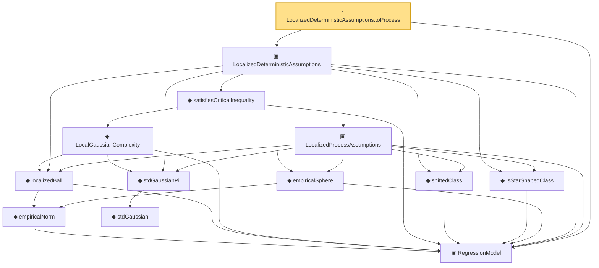

# Proof narrative — LocalizedDeterministicAssumptions.toProcess

Root: **LocalizedDeterministicAssumptions.toProcess** (lemma) `Statlib/Regression/LocalizedDeterministicAssumptions_toProcess.lean:12` · topic `Regression`
Closure: 13 declarations across 12 files. Generated from `proof_graph.json` — no files were moved.

Reading order (foundations first, headline last):

  ▣ `RegressionModel` — structure · `Statlib/Regression/Basic.lean:29`  _(also used by 73: excessRisk, LocalGaussianComplexityEntropyAssumptions, LocalGaussianComplexityProxyAssumptions, …)_
      ◆ `empiricalNorm` — def · `Statlib/Regression/empiricalNorm.lean:10`  _(also used by 25: LocalizedProbabilityAssumptions, LocalizedProbabilityAssumptions.ofDeterministic, LocalizedProbabilityAssumptions.ofProcessAndComplexity, …)_
    ◆ `localizedBall` — def · `Statlib/Regression/localizedBall.lean:11`  _(also used by 4: LocalGaussianComplexityEntropyAssumptions, LocalizedProxyCriticalAssumptions, dudleyEntropyUpper, …)_
          ◆ `stdGaussian` — abbrev · `Statlib/Gaussian/Basic.lean:29`  _(also used by 97: TensorizationLSIAt, stdGaussianPi_absolutelyContinuous, integrable_mul_gaussianPDFReal_of_memLp, …)_
    ◆ `stdGaussianPi` — def · `Statlib/Gaussian/Basic.lean:32`  _(also used by 66: TensorizationLSIAt, GaussianSobolevRegularity, isProbabilityMeasure_stdGaussianPi, …)_
      ◆ `LocalGaussianComplexity` — def · `Statlib/Regression/LocalGaussianComplexity.lean:11`  _(also used by 10: LocalGaussianComplexityEntropyAssumptions, LocalGaussianComplexityProxyAssumptions, LocalizedProxyCriticalAssumptions, …)_
    ◆ `satisfiesCriticalInequality` — def · `Statlib/Regression/satisfiesCriticalInequality.lean:11`  _(also used by 7: LocalizedDeterministicAssumptions.ofProcessAndCI, LocalizedDeterministicAssumptions.ofProcessAndComplexity, LocalizedDeterministicAssumptions.ofProcessAndEntropy, …)_
    ◆ `shiftedClass` — def · `Statlib/Regression/shiftedClass.lean:10`  _(also used by 7: LocalizedDeterministicAssumptions.ofProcessAndCI, LocalizedDeterministicAssumptions.ofProcessAndComplexity, LocalizedDeterministicAssumptions.ofProcessAndEntropy, …)_
    ◆ `IsStarShapedClass` — def · `Statlib/Regression/IsStarShapedClass.lean:10`  _(also used by 1: LocalizedProxyCriticalAssumptions)_
    ◆ `empiricalSphere` — def · `Statlib/Regression/empiricalSphere.lean:11`  _(also used by 1: LocalizedProxyCriticalAssumptions)_
  ▣ `LocalizedDeterministicAssumptions` — structure · `Statlib/Regression/LocalizedDeterministicAssumptions.lean:15`  _(also used by 4: LocalizedDeterministicAssumptions.ofProcessAndCI, LocalizedDeterministicAssumptions.ofProcessAndComplexity, LocalizedDeterministicAssumptions.ofProcessAndEntropy, …)_
  ▣ `LocalizedProcessAssumptions` — structure · `Statlib/Regression/LocalizedProcessAssumptions.lean:14`  _(also used by 5: LocalizedDeterministicAssumptions.ofProcessAndCI, LocalizedDeterministicAssumptions.ofProcessAndComplexity, LocalizedDeterministicAssumptions.ofProcessAndEntropy, …)_
· `LocalizedDeterministicAssumptions.toProcess` — lemma · `Statlib/Regression/LocalizedDeterministicAssumptions_toProcess.lean:12` **← headline**

## Dependency diagram

