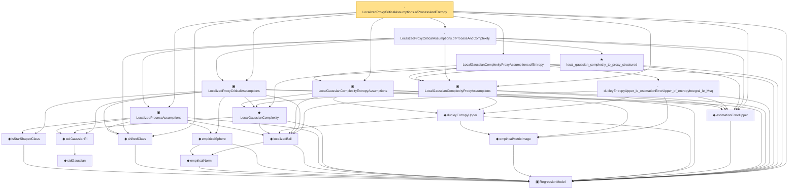

# Proof narrative — LocalizedProxyCriticalAssumptions.ofProcessAndEntropy

Root: **LocalizedProxyCriticalAssumptions.ofProcessAndEntropy** (lemma) `Statlib/Regression/LocalizedProxyCriticalAssumptions_ofProcessAndEntropy.lean:20` · topic `Regression`
Closure: 21 declarations across 20 files. Generated from `proof_graph.json` — no files were moved.

Reading order (foundations first, headline last):

  ▣ `RegressionModel` — structure · `Statlib/Regression/Basic.lean:29`  _(also used by 65: excessRisk, LocalizedDeterministicAssumptions, LocalizedDeterministicAssumptions.ofProcessAndCI, …)_
    ◆ `IsStarShapedClass` — def · `Statlib/Regression/IsStarShapedClass.lean:10`  _(also used by 1: LocalizedDeterministicAssumptions)_
  ◆ `shiftedClass` — def · `Statlib/Regression/shiftedClass.lean:10`  _(also used by 5: LocalizedDeterministicAssumptions, LocalizedDeterministicAssumptions.ofProcessAndCI, LocalizedDeterministicAssumptions.ofProcessAndComplexity, …)_
      ◆ `empiricalNorm` — def · `Statlib/Regression/empiricalNorm.lean:10`  _(also used by 25: LocalizedProbabilityAssumptions, LocalizedProbabilityAssumptions.ofDeterministic, LocalizedProbabilityAssumptions.ofProcessAndComplexity, …)_
    ◆ `empiricalSphere` — def · `Statlib/Regression/empiricalSphere.lean:11`  _(also used by 1: LocalizedDeterministicAssumptions)_
    ◆ `localizedBall` — def · `Statlib/Regression/localizedBall.lean:11`  _(also used by 1: LocalizedDeterministicAssumptions)_
      ◆ `stdGaussian` — abbrev · `Statlib/Gaussian/Basic.lean:29`  _(also used by 97: TensorizationLSIAt, stdGaussianPi_absolutelyContinuous, integrable_mul_gaussianPDFReal_of_memLp, …)_
    ◆ `stdGaussianPi` — def · `Statlib/Gaussian/Basic.lean:32`  _(also used by 66: TensorizationLSIAt, GaussianSobolevRegularity, isProbabilityMeasure_stdGaussianPi, …)_
  ▣ `LocalizedProcessAssumptions` — structure · `Statlib/Regression/LocalizedProcessAssumptions.lean:14`  _(also used by 4: LocalizedDeterministicAssumptions.ofProcessAndCI, LocalizedDeterministicAssumptions.ofProcessAndComplexity, LocalizedDeterministicAssumptions.ofProcessAndEntropy, …)_
    ◆ `LocalGaussianComplexity` — def · `Statlib/Regression/LocalGaussianComplexity.lean:11`  _(also used by 7: localGaussianComplexity_le_of_satisfiesCriticalInequality, local_gaussian_complexity_bound, local_gaussian_complexity_to_proxy, …)_
    ◆ `empiricalMetricImage` — def · `Statlib/Regression/empiricalMetricImage.lean:11`
    ◆ `dudleyEntropyUpper` — def · `Statlib/Regression/dudleyEntropyUpper.lean:12`  _(also used by 2: local_gaussian_complexity_bound, local_gaussian_complexity_to_proxy)_
  ▣ `LocalGaussianComplexityEntropyAssumptions` — structure · `Statlib/Regression/LocalGaussianComplexityEntropyAssumptions.lean:14`  _(also used by 1: LocalizedDeterministicAssumptions.ofProcessAndEntropy)_
  ◆ `estimationErrorUpper` — def · `Statlib/Regression/estimationErrorUpper.lean:11`  _(also used by 46: LocalizedDeterministicAssumptions.ofProcessAndComplexity, LocalizedDeterministicAssumptions.ofProcessAndEntropy, capacity_control, …)_
  ▣ `LocalizedProxyCriticalAssumptions` — structure · `Statlib/Regression/LocalizedProxyCriticalAssumptions.lean:17`  _(also used by 1: LocalizedProxyCriticalAssumptions.toDeterministic)_
  ▣ `LocalGaussianComplexityProxyAssumptions` — structure · `Statlib/Regression/LocalGaussianComplexityProxyAssumptions.lean:13`  _(also used by 3: LocalizedDeterministicAssumptions.ofProcessAndComplexity, LocalizedDeterministicAssumptions.ofProcessAndEntropy, satisfiesCriticalInequality_of_localGaussianComplexityProxyAssumptions)_
    · `dudleyEntropyUpper_le_estimationErrorUpper_of_entropyIntegral_le_Msq` — lemma · `Statlib/Regression/dudleyEntropyUpper_le_estimationErrorUpper_of_entropyIntegral_le_Msq.lean:15`
  · `LocalGaussianComplexityProxyAssumptions.ofEntropy` — lemma · `Statlib/Regression/LocalGaussianComplexityProxyAssumptions_ofEntropy.lean:13`  _(also used by 1: LocalizedDeterministicAssumptions.ofProcessAndEntropy)_
    ★ `local_gaussian_complexity_to_proxy_structured` — theorem · `Statlib/Regression/local_gaussian_complexity_to_proxy_structured.lean:13`  _(also used by 1: satisfiesCriticalInequality_of_localGaussianComplexityProxyAssumptions)_
  · `LocalizedProxyCriticalAssumptions.ofProcessAndComplexity` — lemma · `Statlib/Regression/LocalizedProxyCriticalAssumptions_ofProcessAndComplexity.lean:19`
· `LocalizedProxyCriticalAssumptions.ofProcessAndEntropy` — lemma · `Statlib/Regression/LocalizedProxyCriticalAssumptions_ofProcessAndEntropy.lean:20` **← headline**

## Dependency diagram

