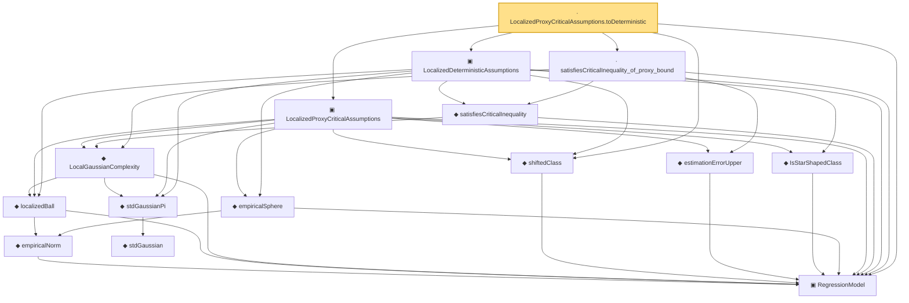

# Proof narrative — LocalizedProxyCriticalAssumptions.toDeterministic

Root: **LocalizedProxyCriticalAssumptions.toDeterministic** (lemma) `Statlib/Regression/LocalizedProxyCriticalAssumptions_toDeterministic.lean:14` · topic `Regression`
Closure: 15 declarations across 14 files. Generated from `proof_graph.json` — no files were moved.

Reading order (foundations first, headline last):

  ▣ `RegressionModel` — structure · `Statlib/Regression/Basic.lean:29`  _(also used by 71: excessRisk, LocalGaussianComplexityEntropyAssumptions, LocalGaussianComplexityProxyAssumptions, …)_
      ◆ `empiricalNorm` — def · `Statlib/Regression/empiricalNorm.lean:10`  _(also used by 25: LocalizedProbabilityAssumptions, LocalizedProbabilityAssumptions.ofDeterministic, LocalizedProbabilityAssumptions.ofProcessAndComplexity, …)_
    ◆ `localizedBall` — def · `Statlib/Regression/localizedBall.lean:11`  _(also used by 4: LocalGaussianComplexityEntropyAssumptions, LocalizedProcessAssumptions, dudleyEntropyUpper, …)_
        ◆ `stdGaussian` — abbrev · `Statlib/Gaussian/Basic.lean:29`  _(also used by 97: TensorizationLSIAt, stdGaussianPi_absolutelyContinuous, integrable_mul_gaussianPDFReal_of_memLp, …)_
    ◆ `stdGaussianPi` — def · `Statlib/Gaussian/Basic.lean:32`  _(also used by 66: TensorizationLSIAt, GaussianSobolevRegularity, isProbabilityMeasure_stdGaussianPi, …)_
    ◆ `LocalGaussianComplexity` — def · `Statlib/Regression/LocalGaussianComplexity.lean:11`  _(also used by 8: LocalGaussianComplexityEntropyAssumptions, LocalGaussianComplexityProxyAssumptions, localGaussianComplexity_le_of_satisfiesCriticalInequality, …)_
  ◆ `shiftedClass` — def · `Statlib/Regression/shiftedClass.lean:10`  _(also used by 6: LocalizedDeterministicAssumptions.ofProcessAndCI, LocalizedDeterministicAssumptions.ofProcessAndComplexity, LocalizedDeterministicAssumptions.ofProcessAndEntropy, …)_
    ◆ `estimationErrorUpper` — def · `Statlib/Regression/estimationErrorUpper.lean:11`  _(also used by 50: LocalGaussianComplexityProxyAssumptions, LocalizedDeterministicAssumptions.ofProcessAndComplexity, LocalizedDeterministicAssumptions.ofProcessAndEntropy, …)_
    ◆ `IsStarShapedClass` — def · `Statlib/Regression/IsStarShapedClass.lean:10`  _(also used by 1: LocalizedProcessAssumptions)_
    ◆ `empiricalSphere` — def · `Statlib/Regression/empiricalSphere.lean:11`  _(also used by 1: LocalizedProcessAssumptions)_
  ▣ `LocalizedProxyCriticalAssumptions` — structure · `Statlib/Regression/LocalizedProxyCriticalAssumptions.lean:17`  _(also used by 2: LocalizedProxyCriticalAssumptions.ofProcessAndComplexity, LocalizedProxyCriticalAssumptions.ofProcessAndEntropy)_
    ◆ `satisfiesCriticalInequality` — def · `Statlib/Regression/satisfiesCriticalInequality.lean:11`  _(also used by 6: LocalizedDeterministicAssumptions.ofProcessAndCI, LocalizedDeterministicAssumptions.ofProcessAndComplexity, LocalizedDeterministicAssumptions.ofProcessAndEntropy, …)_
  ▣ `LocalizedDeterministicAssumptions` — structure · `Statlib/Regression/LocalizedDeterministicAssumptions.lean:15`  _(also used by 4: LocalizedDeterministicAssumptions.ofProcessAndCI, LocalizedDeterministicAssumptions.ofProcessAndComplexity, LocalizedDeterministicAssumptions.ofProcessAndEntropy, …)_
  · `satisfiesCriticalInequality_of_proxy_bound` — lemma · `Statlib/Regression/satisfiesCriticalInequality_of_proxy_bound.lean:13`  _(also used by 1: satisfiesCriticalInequality_of_localGaussianComplexityProxyAssumptions)_
· `LocalizedProxyCriticalAssumptions.toDeterministic` — lemma · `Statlib/Regression/LocalizedProxyCriticalAssumptions_toDeterministic.lean:14` **← headline**

## Dependency diagram

