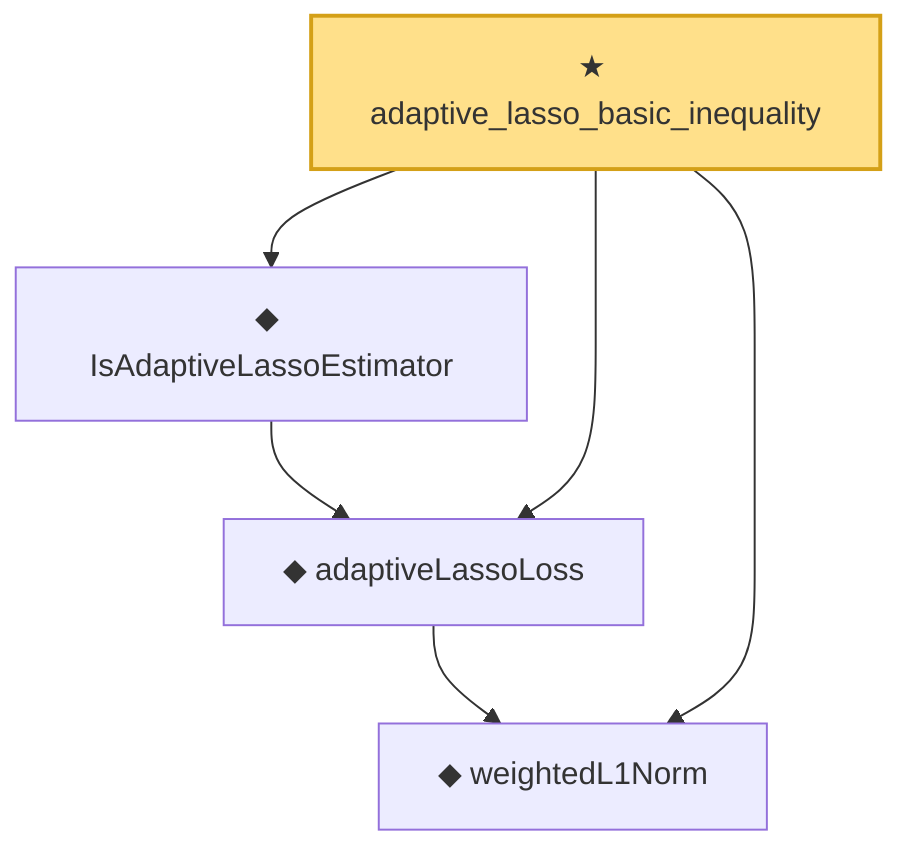

# Proof narrative — adaptive_lasso_basic_inequality

Root: **adaptive_lasso_basic_inequality** (theorem) `Statlib/Regression/adaptive_lasso_basic_inequality.lean:22` · topic `Regression`
Closure: 4 declarations across 4 files. Generated from `proof_graph.json` — no files were moved.

Reading order (foundations first, headline last):

  ◆ `weightedL1Norm` — def · `Statlib/Regression/weightedL1Norm.lean:11`  _(also used by 2: weightedL1Norm_nonneg, weightedL1Norm_one_eq_l1Norm)_
  ◆ `adaptiveLassoLoss` — noncomputable def · `Statlib/Regression/adaptiveLassoLoss.lean:12`  _(also used by 1: IsAdaptiveLassoEstimator.isLassoEstimator_of_w_one)_
  ◆ `IsAdaptiveLassoEstimator` — def · `Statlib/Regression/IsAdaptiveLassoEstimator.lean:10`  _(also used by 1: IsAdaptiveLassoEstimator.isLassoEstimator_of_w_one)_
★ `adaptive_lasso_basic_inequality` — theorem · `Statlib/Regression/adaptive_lasso_basic_inequality.lean:22` **← headline**

## Dependency diagram

