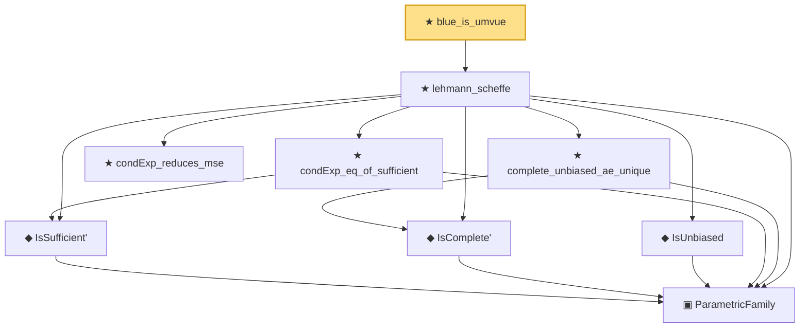

# Proof narrative — blue_is_umvue

Root: **blue_is_umvue** (theorem) `Statlib/Regression/blue_is_umvue.lean:27` · topic `Regression`
Closure: 9 declarations across 6 files. Generated from `proof_graph.json` — no files were moved.

Reading order (foundations first, headline last):

    ▣ `ParametricFamily` — structure · `Statlib/Statistic/Basic.lean:64`  _(also used by 41: CoverageProb, IsConfidenceInterval, IsConfidenceSet, …)_
    ◆ `IsSufficient'` — def · `Statlib/Statistic/Basic.lean:83`  _(also used by 2: IsMinimalSufficient', minimalSufficient_of_subfamily)_
    ◆ `IsComplete'` — def · `Statlib/Statistic/Basic.lean:69`
    ◆ `IsUnbiased` — def · `Statlib/Statistic/Basic.lean:93`  _(also used by 2: IsEfficient, IsUMVUE)_
    ★ `condExp_eq_of_sufficient` — theorem · `Statlib/Sufficiency/condExp_eq_of_sufficient.lean:18`  _(also used by 2: umvue_iff_orthogonal_to_sufficient_unbiasedOfZero, unestimable_of_complete_no_function)_
    ★ `condExp_reduces_mse` — theorem · `Statlib/Sufficiency/condExp_reduces_mse.lean:20`
    ★ `complete_unbiased_ae_unique` — theorem · `Statlib/Sufficiency/complete_unbiased_ae_unique.lean:16`  _(also used by 1: expfamily_umvue)_
  ★ `lehmann_scheffe` — theorem · `Statlib/Sufficiency/lehmann_scheffe.lean:29`  _(also used by 1: rao_blackwell_umvue)_
★ `blue_is_umvue` — theorem · `Statlib/Regression/blue_is_umvue.lean:27` **← headline**

## Dependency diagram

