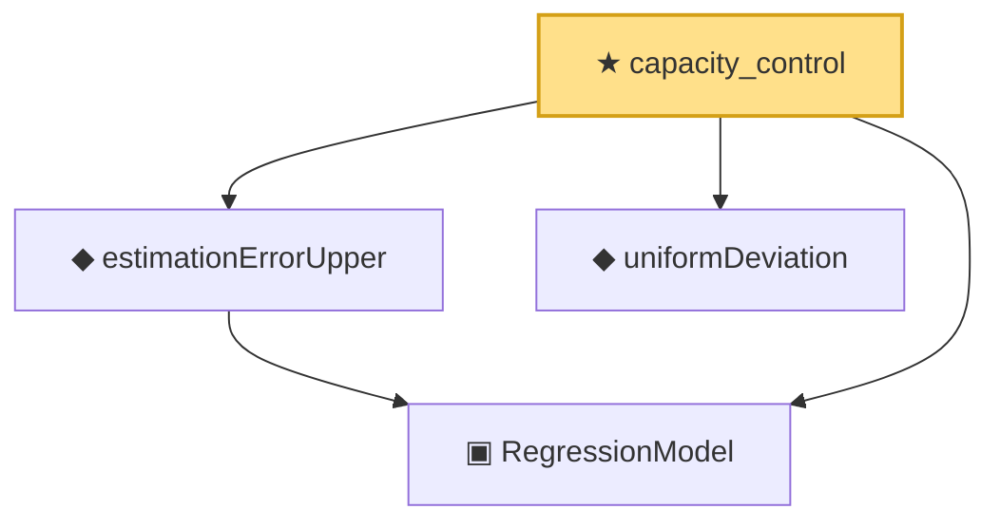

# Proof narrative — capacity_control

Root: **capacity_control** (theorem) `Statlib/Regression/capacity_control.lean:15` · topic `Regression`
Closure: 4 declarations across 4 files. Generated from `proof_graph.json` — no files were moved.

Reading order (foundations first, headline last):

  ▣ `RegressionModel` — structure · `Statlib/Regression/Basic.lean:29`  _(also used by 81: excessRisk, IsStarShapedClass, LocalGaussianComplexity, …)_
  ◆ `estimationErrorUpper` — def · `Statlib/Regression/estimationErrorUpper.lean:11`  _(also used by 51: LocalGaussianComplexityProxyAssumptions, LocalizedDeterministicAssumptions.ofProcessAndComplexity, LocalizedDeterministicAssumptions.ofProcessAndEntropy, …)_
  ◆ `uniformDeviation` — def · `Statlib/Regression/uniformDeviation.lean:10`
★ `capacity_control` — theorem · `Statlib/Regression/capacity_control.lean:15` **← headline**

## Dependency diagram

