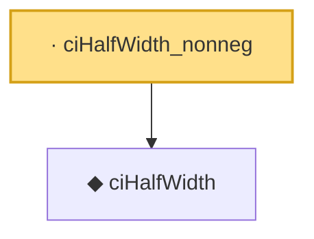

# Proof narrative — ciHalfWidth_nonneg

Root: **ciHalfWidth_nonneg** (lemma) `Statlib/Regression/ciHalfWidth_nonneg.lean:7` · topic `Regression`
Closure: 2 declarations across 2 files. Generated from `proof_graph.json` — no files were moved.

Reading order (foundations first, headline last):

  ◆ `ciHalfWidth` — noncomputable def · `Statlib/Regression/ciHalfWidth.lean:7`  _(also used by 4: CoversParameter_iff_dist_le, CoversParameter.mono_q, ciHalfWidth_zero, …)_
· `ciHalfWidth_nonneg` — lemma · `Statlib/Regression/ciHalfWidth_nonneg.lean:7` **← headline**

## Dependency diagram

