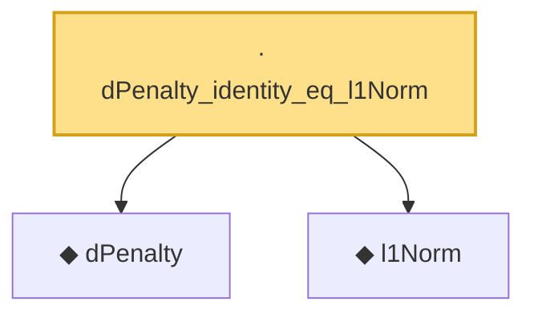

# Proof narrative — dPenalty_identity_eq_l1Norm

Root: **dPenalty_identity_eq_l1Norm** (lemma) `Statlib/Regression/dPenalty_identity_eq_l1Norm.lean:10` · topic `Regression`
Closure: 3 declarations across 3 files. Generated from `proof_graph.json` — no files were moved.

Reading order (foundations first, headline last):

  ◆ `dPenalty` — def · `Statlib/Regression/dPenalty.lean:10`  _(also used by 4: dPenalty_nonneg, generalizedLassoLoss, generalizedLassoLoss_nonneg, …)_
  ◆ `l1Norm` — def · `Statlib/Regression/l1Norm.lean:15`  _(also used by 25: IsDantzigSelector, IsDantzigSelector.l1_le_truth, IsSqrtLassoEstimator.l1_diff_bound, …)_
· `dPenalty_identity_eq_l1Norm` — lemma · `Statlib/Regression/dPenalty_identity_eq_l1Norm.lean:10` **← headline**

## Dependency diagram

