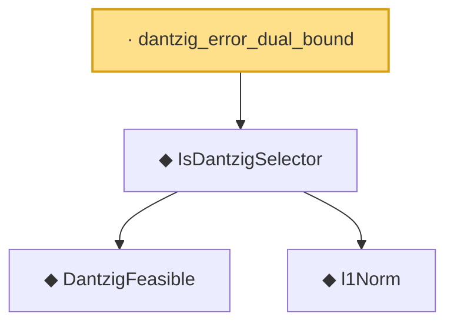

# Proof narrative — dantzig_error_dual_bound

Root: **dantzig_error_dual_bound** (lemma) `Statlib/Regression/dantzig_error_dual_bound.lean:9` · topic `Regression`
Closure: 4 declarations across 4 files. Generated from `proof_graph.json` — no files were moved.

Reading order (foundations first, headline last):

    ◆ `DantzigFeasible` — def · `Statlib/Regression/DantzigFeasible.lean:9`  _(also used by 2: DantzigFeasible.of_good_event, DantzigFeasible_zero_iff)_
    ◆ `l1Norm` — def · `Statlib/Regression/l1Norm.lean:15`  _(also used by 25: IsDantzigSelector.l1_le_truth, IsSqrtLassoEstimator.l1_diff_bound, dPenalty_identity_eq_l1Norm, …)_
  ◆ `IsDantzigSelector` — def · `Statlib/Regression/IsDantzigSelector.lean:9`  _(also used by 1: IsDantzigSelector.l1_le_truth)_
· `dantzig_error_dual_bound` — lemma · `Statlib/Regression/dantzig_error_dual_bound.lean:9` **← headline**

## Dependency diagram

