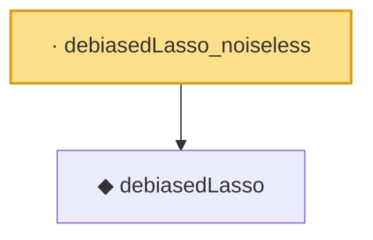

# Proof narrative — debiasedLasso_noiseless

Root: **debiasedLasso_noiseless** (lemma) `Statlib/Regression/debiasedLasso_noiseless.lean:12` · topic `Regression`
Closure: 2 declarations across 2 files. Generated from `proof_graph.json` — no files were moved.

Reading order (foundations first, headline last):

  ◆ `debiasedLasso` — noncomputable def · `Statlib/Regression/debiasedLasso.lean:12`  _(also used by 1: debiasedLasso_minus_truth_eq)_
· `debiasedLasso_noiseless` — lemma · `Statlib/Regression/debiasedLasso_noiseless.lean:12` **← headline**

## Dependency diagram

