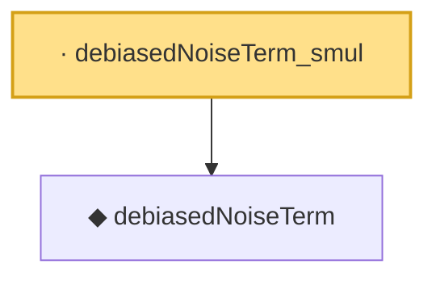

# Proof narrative — debiasedNoiseTerm_smul

Root: **debiasedNoiseTerm_smul** (lemma) `Statlib/Regression/debiasedNoiseTerm_smul.lean:11` · topic `Regression`
Closure: 2 declarations across 2 files. Generated from `proof_graph.json` — no files were moved.

Reading order (foundations first, headline last):

  ◆ `debiasedNoiseTerm` — noncomputable def · `Statlib/Regression/debiasedNoiseTerm.lean:9`  _(also used by 1: debiasedNoiseTerm_zero)_
· `debiasedNoiseTerm_smul` — lemma · `Statlib/Regression/debiasedNoiseTerm_smul.lean:11` **← headline**

## Dependency diagram

