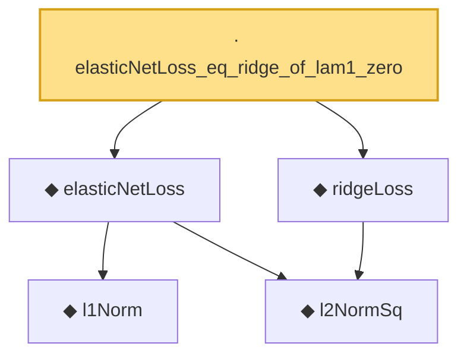

# Proof narrative — elasticNetLoss_eq_ridge_of_lam1_zero

Root: **elasticNetLoss_eq_ridge_of_lam1_zero** (lemma) `Statlib/Regression/elasticNetLoss_eq_ridge_of_lam1_zero.lean:10` · topic `Regression`
Closure: 5 declarations across 5 files. Generated from `proof_graph.json` — no files were moved.

Reading order (foundations first, headline last):

    ◆ `l1Norm` — def · `Statlib/Regression/l1Norm.lean:15`  _(also used by 25: IsDantzigSelector, IsDantzigSelector.l1_le_truth, IsSqrtLassoEstimator.l1_diff_bound, …)_
    ◆ `l2NormSq` — def · `Statlib/Regression/l2NormSq.lean:14`  _(also used by 7: IsRidgeEstimator.shrinkage_bound, elasticNetLoss_nonneg, elastic_net_basic_inequality, …)_
  ◆ `elasticNetLoss` — noncomputable def · `Statlib/Regression/elasticNetLoss.lean:10`  _(also used by 4: IsElasticNetEstimator, elasticNetLoss_eq_lasso_of_lam2_zero, elasticNetLoss_nonneg, …)_
  ◆ `ridgeLoss` — noncomputable def · `Statlib/Regression/ridgeLoss.lean:15`  _(also used by 3: IsRidgeEstimator, IsRidgeEstimator.shrinkage_bound, ridgeLoss_nonneg)_
· `elasticNetLoss_eq_ridge_of_lam1_zero` — lemma · `Statlib/Regression/elasticNetLoss_eq_ridge_of_lam1_zero.lean:10` **← headline**

## Dependency diagram

