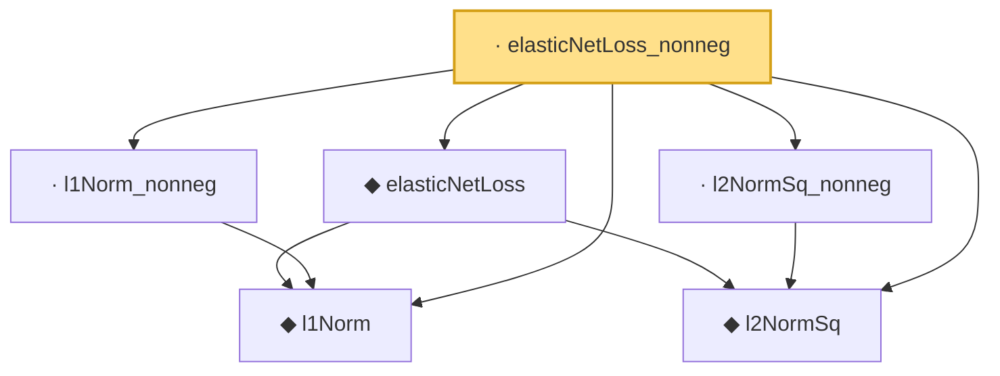

# Proof narrative — elasticNetLoss_nonneg

Root: **elasticNetLoss_nonneg** (lemma) `Statlib/Regression/elasticNetLoss_nonneg.lean:10` · topic `Regression`
Closure: 6 declarations across 6 files. Generated from `proof_graph.json` — no files were moved.

Reading order (foundations first, headline last):

  ◆ `l1Norm` — def · `Statlib/Regression/l1Norm.lean:15`  _(also used by 23: IsDantzigSelector, IsDantzigSelector.l1_le_truth, IsSqrtLassoEstimator.l1_diff_bound, …)_
  ◆ `l2NormSq` — def · `Statlib/Regression/l2NormSq.lean:14`  _(also used by 6: IsRidgeEstimator.shrinkage_bound, elastic_net_basic_inequality, ridgeLoss, …)_
  ◆ `elasticNetLoss` — noncomputable def · `Statlib/Regression/elasticNetLoss.lean:10`  _(also used by 4: IsElasticNetEstimator, elasticNetLoss_eq_lasso_of_lam2_zero, elasticNetLoss_eq_ridge_of_lam1_zero, …)_
  · `l1Norm_nonneg` — lemma · `Statlib/Regression/l1Norm_nonneg.lean:13`  _(also used by 6: fusedLassoLoss_nonneg, lasso_l2_error_on_support, lasso_prediction_error, …)_
  · `l2NormSq_nonneg` — lemma · `Statlib/Regression/l2NormSq_nonneg.lean:12`  _(also used by 1: ridgeLoss_nonneg)_
· `elasticNetLoss_nonneg` — lemma · `Statlib/Regression/elasticNetLoss_nonneg.lean:10` **← headline**

## Dependency diagram

