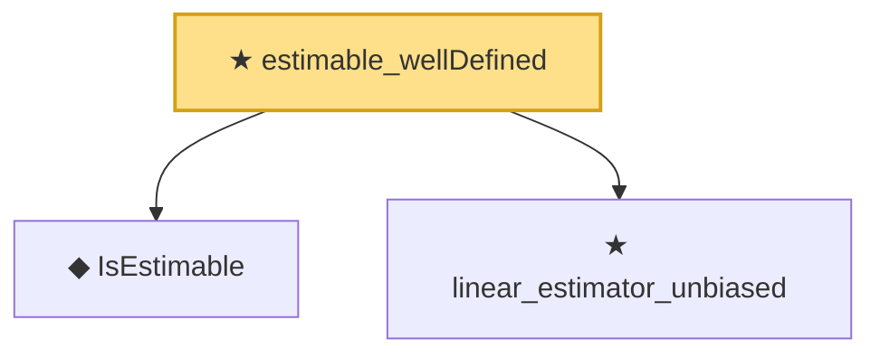

# Proof narrative — estimable_wellDefined

Root: **estimable_wellDefined** (theorem) `Statlib/Regression/estimable_wellDefined.lean:19` · topic `Regression`
Closure: 3 declarations across 3 files. Generated from `proof_graph.json` — no files were moved.

Reading order (foundations first, headline last):

  ◆ `IsEstimable` — def · `Statlib/Regression/IsEstimable.lean:21`  _(also used by 8: exists_linear_unbiased_iff_estimable, isEstimable_iff_in_range_Q, isEstimable_iff_in_range_normal, …)_
  ★ `linear_estimator_unbiased` — theorem · `Statlib/Regression/linear_estimator_unbiased.lean:20`  _(also used by 1: linear_unbiased_iff_Ztrans_eq)_
★ `estimable_wellDefined` — theorem · `Statlib/Regression/estimable_wellDefined.lean:19` **← headline**

## Dependency diagram

