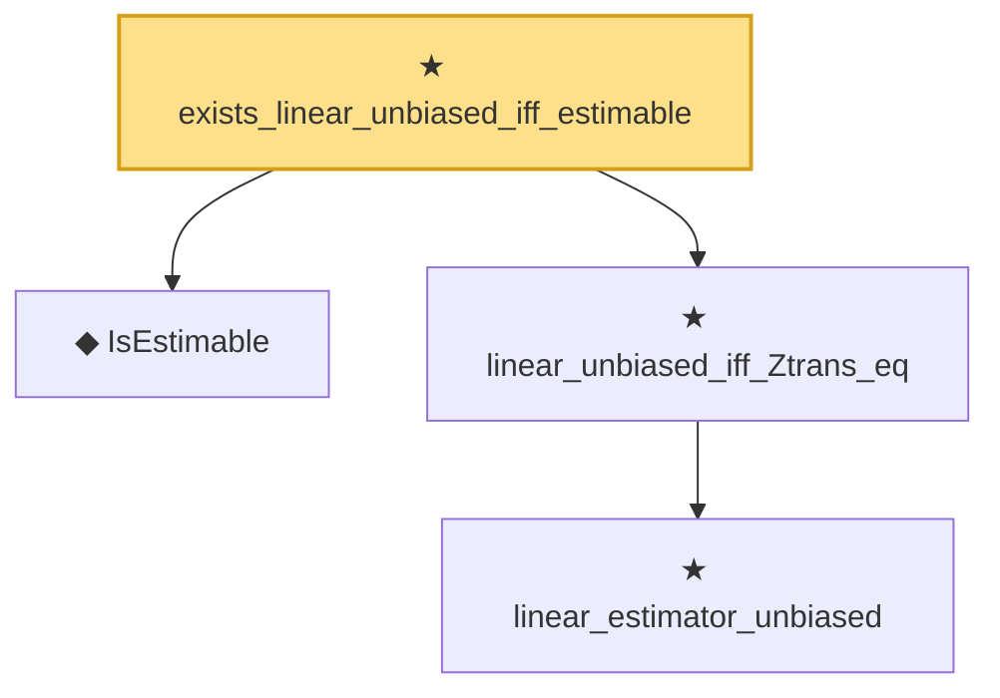

# Proof narrative — exists_linear_unbiased_iff_estimable

Root: **exists_linear_unbiased_iff_estimable** (theorem) `Statlib/Regression/exists_linear_unbiased_iff_estimable.lean:21` · topic `Regression`
Closure: 4 declarations across 4 files. Generated from `proof_graph.json` — no files were moved.

Reading order (foundations first, headline last):

  ◆ `IsEstimable` — def · `Statlib/Regression/IsEstimable.lean:21`  _(also used by 8: estimable_wellDefined, isEstimable_iff_in_range_Q, isEstimable_iff_in_range_normal, …)_
    ★ `linear_estimator_unbiased` — theorem · `Statlib/Regression/linear_estimator_unbiased.lean:20`  _(also used by 1: estimable_wellDefined)_
  ★ `linear_unbiased_iff_Ztrans_eq` — theorem · `Statlib/Regression/linear_unbiased_iff_Ztrans_eq.lean:28`
★ `exists_linear_unbiased_iff_estimable` — theorem · `Statlib/Regression/exists_linear_unbiased_iff_estimable.lean:21` **← headline**

## Dependency diagram

