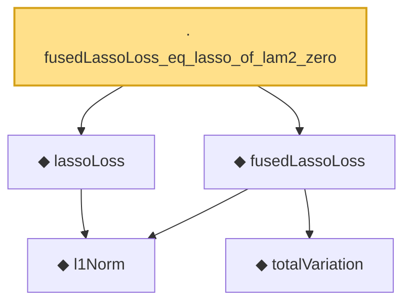

# Proof narrative — fusedLassoLoss_eq_lasso_of_lam2_zero

Root: **fusedLassoLoss_eq_lasso_of_lam2_zero** (lemma) `Statlib/Regression/fusedLassoLoss_eq_lasso_of_lam2_zero.lean:9` · topic `Regression`
Closure: 5 declarations across 5 files. Generated from `proof_graph.json` — no files were moved.

Reading order (foundations first, headline last):

    ◆ `l1Norm` — def · `Statlib/Regression/l1Norm.lean:15`  _(also used by 24: IsDantzigSelector, IsDantzigSelector.l1_le_truth, IsSqrtLassoEstimator.l1_diff_bound, …)_
    ◆ `totalVariation` — def · `Statlib/Regression/totalVariation.lean:13`  _(also used by 4: fusedLassoLoss_nonneg, totalVariation_const, totalVariation_nonneg, …)_
  ◆ `fusedLassoLoss` — noncomputable def · `Statlib/Regression/fusedLassoLoss.lean:12`  _(also used by 2: IsFusedLassoEstimator, fusedLassoLoss_nonneg)_
  ◆ `lassoLoss` — noncomputable def · `Statlib/Regression/lassoLoss.lean:16`  _(also used by 4: IsAdaptiveLassoEstimator.isLassoEstimator_of_w_one, IsLassoEstimator, elasticNetLoss_eq_lasso_of_lam2_zero, …)_
· `fusedLassoLoss_eq_lasso_of_lam2_zero` — lemma · `Statlib/Regression/fusedLassoLoss_eq_lasso_of_lam2_zero.lean:9` **← headline**

## Dependency diagram

