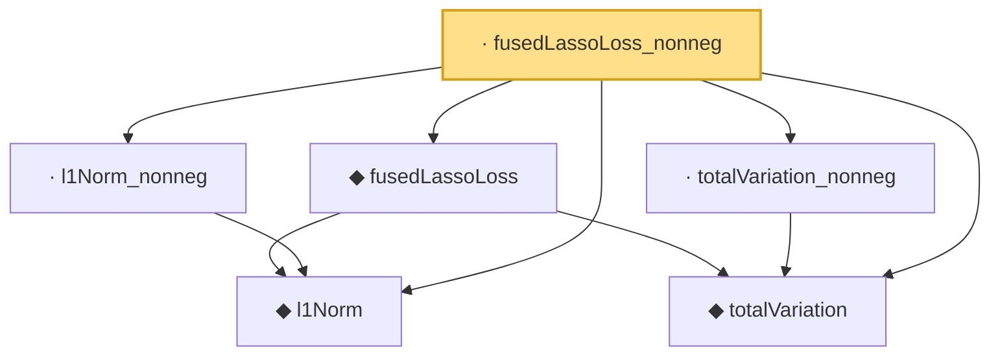

# Proof narrative — fusedLassoLoss_nonneg

Root: **fusedLassoLoss_nonneg** (lemma) `Statlib/Regression/fusedLassoLoss_nonneg.lean:12` · topic `Regression`
Closure: 6 declarations across 6 files. Generated from `proof_graph.json` — no files were moved.

Reading order (foundations first, headline last):

  ◆ `l1Norm` — def · `Statlib/Regression/l1Norm.lean:15`  _(also used by 23: IsDantzigSelector, IsDantzigSelector.l1_le_truth, IsSqrtLassoEstimator.l1_diff_bound, …)_
  ◆ `totalVariation` — def · `Statlib/Regression/totalVariation.lean:13`  _(also used by 2: totalVariation_const, totalVariation_smul)_
  ◆ `fusedLassoLoss` — noncomputable def · `Statlib/Regression/fusedLassoLoss.lean:12`  _(also used by 2: IsFusedLassoEstimator, fusedLassoLoss_eq_lasso_of_lam2_zero)_
  · `l1Norm_nonneg` — lemma · `Statlib/Regression/l1Norm_nonneg.lean:13`  _(also used by 6: elasticNetLoss_nonneg, lasso_l2_error_on_support, lasso_prediction_error, …)_
  · `totalVariation_nonneg` — lemma · `Statlib/Regression/totalVariation_nonneg.lean:8`
· `fusedLassoLoss_nonneg` — lemma · `Statlib/Regression/fusedLassoLoss_nonneg.lean:12` **← headline**

## Dependency diagram

