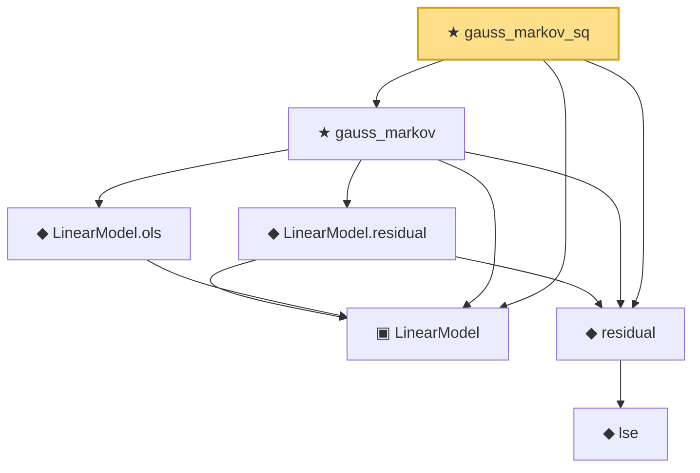

# Proof narrative — gauss_markov_sq

Root: **gauss_markov_sq** (theorem) `Statlib/Regression/gauss_markov_sq.lean:13` · topic `Regression`
Closure: 7 declarations across 6 files. Generated from `proof_graph.json` — no files were moved.

Reading order (foundations first, headline last):

  ▣ `LinearModel` — structure · `Statlib/Regression/LinearModel.lean:11`  _(also used by 2: ols_pythagorean, ols_residual_orthogonal)_
    ◆ `lse` — def · `Statlib/Regression/NormalLinearModel.lean:111`  _(also used by 3: lse_indep_sigmaSqHat, lse_distribution, lse_sigma_hat_distribution_under_a1)_
  ◆ `residual` — def · `Statlib/Regression/NormalLinearModel.lean:115`  _(also used by 3: ssr, ols_pythagorean, ols_residual_orthogonal)_
    ◆ `LinearModel.residual` — def · `Statlib/Regression/LinearModel_residual.lean:11`  _(also used by 1: ols_pythagorean)_
    ◆ `LinearModel.ols` — def · `Statlib/Regression/LinearModel_ols.lean:10`
  ★ `gauss_markov` — theorem · `Statlib/Regression/gauss_markov.lean:18`
★ `gauss_markov_sq` — theorem · `Statlib/Regression/gauss_markov_sq.lean:13` **← headline**

## Dependency diagram

