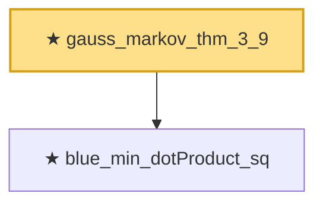

# Proof narrative — gauss_markov_thm_3_9

Root: **gauss_markov_thm_3_9** (theorem) `Statlib/Regression/gauss_markov_thm_3_9.lean:28` · topic `Regression`
Closure: 2 declarations across 2 files. Generated from `proof_graph.json` — no files were moved.

Reading order (foundations first, headline last):

  ★ `blue_min_dotProduct_sq` — theorem · `Statlib/Regression/blue_min_dotProduct_sq.lean:22`
★ `gauss_markov_thm_3_9` — theorem · `Statlib/Regression/gauss_markov_thm_3_9.lean:28` **← headline**

## Dependency diagram

