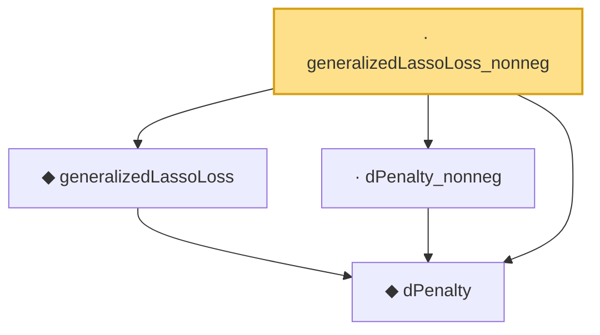

# Proof narrative — generalizedLassoLoss_nonneg

Root: **generalizedLassoLoss_nonneg** (lemma) `Statlib/Regression/generalizedLassoLoss_nonneg.lean:12` · topic `Regression`
Closure: 4 declarations across 4 files. Generated from `proof_graph.json` — no files were moved.

Reading order (foundations first, headline last):

  ◆ `dPenalty` — def · `Statlib/Regression/dPenalty.lean:10`  _(also used by 2: dPenalty_identity_eq_l1Norm, generalized_lasso_basic_inequality)_
  ◆ `generalizedLassoLoss` — noncomputable def · `Statlib/Regression/generalizedLassoLoss.lean:12`  _(also used by 2: IsGeneralizedLassoEstimator, generalized_lasso_basic_inequality)_
  · `dPenalty_nonneg` — lemma · `Statlib/Regression/dPenalty_nonneg.lean:8`
· `generalizedLassoLoss_nonneg` — lemma · `Statlib/Regression/generalizedLassoLoss_nonneg.lean:12` **← headline**

## Dependency diagram

