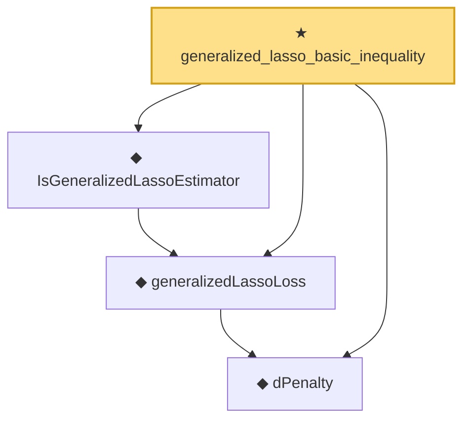

# Proof narrative — generalized_lasso_basic_inequality

Root: **generalized_lasso_basic_inequality** (theorem) `Statlib/Regression/generalized_lasso_basic_inequality.lean:16` · topic `Regression`
Closure: 4 declarations across 4 files. Generated from `proof_graph.json` — no files were moved.

Reading order (foundations first, headline last):

  ◆ `dPenalty` — def · `Statlib/Regression/dPenalty.lean:10`  _(also used by 3: dPenalty_identity_eq_l1Norm, dPenalty_nonneg, generalizedLassoLoss_nonneg)_
  ◆ `generalizedLassoLoss` — noncomputable def · `Statlib/Regression/generalizedLassoLoss.lean:12`  _(also used by 1: generalizedLassoLoss_nonneg)_
  ◆ `IsGeneralizedLassoEstimator` — def · `Statlib/Regression/IsGeneralizedLassoEstimator.lean:10`
★ `generalized_lasso_basic_inequality` — theorem · `Statlib/Regression/generalized_lasso_basic_inequality.lean:16` **← headline**

## Dependency diagram

